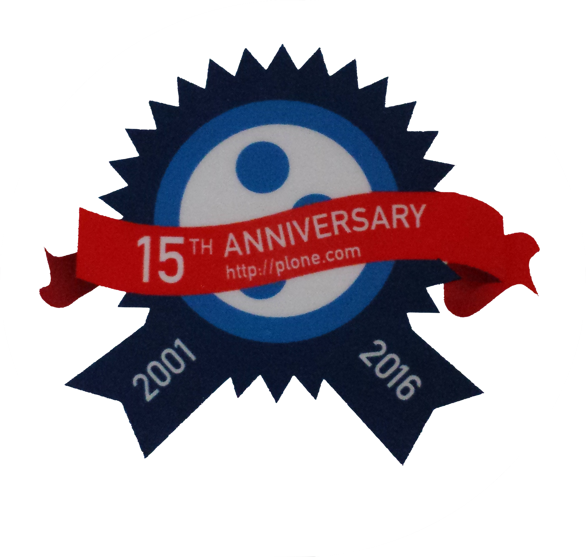

:title: Lessons Learned from other CMS & Wyh Universities love Open Source
:author: Alexander Loechel
:event: DrupalCamp 2016 - Munich
:keywords: Drupal, CMS, CMS-Garden, Plone, Zope, Community, History
:data-transition-duration: 400
:css-all: css/dcmuc2016.css
:auto-console: Yes

.. role:: slide-title-line1
    :class: line1

.. role:: slide-title-line2
    :class: line2

.. role:: slide-title-line3
    :class: line3

.. |br| raw:: html

     

.. |hr| raw:: html

    

.. |rarr| raw:: html

    &rarr;

.. role:: python(code)
   :class: highlight code python
   :language: python

.. role:: red

.. role:: green

----

:id: title
:class: slide lmu-slide title-slide lmu-title-slide level-1
:data-x: 0
:data-y: 0

.. class:: title

    Lessons Learned from other CMS

.. class:: subtitle

and "Why Universities Love Open Source"

.. class:: referent

Alexander Loechel - Referent IT-Projekte |br|
Ludwig-Maximilians-Universität München |br|
DrupalCamp 2016 Munich

.. note::

    Welcome to the LMU

    **Questions to Auditorium:**

    * Who among you know the CMS-Garden

    * Who among you know Zope and Plone?

----

:id: fossscience1
:class: slide lmu-slide level-1
:data-x: r-3500
:data-y: 1000

.. class:: slide-title

  :slide-title-line1:`Why Universities Love or Should Love Open Source`

Free & Open Source Software
===========================

Free & Open Source Software did have a strong tradition in the academia.

Licenses
--------

* GPL
* MIT
* BSD

.. note::

    * GPL (Richard Stallman - MIT - Massachusetts Institute of Technology )
    * MIT License (Massachusetts Institute of Technology - Cambridge/Boston)
    * BSD License (Berkeley Software Distribution - University of California - Berkeley)

----

:id: fossscience2
:class: slide lmu-slide level-1
:data-x: r+0
:data-y: r+1000

.. class:: slide-title

  :slide-title-line1:`Why Universities Love or Should Love Open Source`

Bases for Academic & Science
============================

Science, Research and therefor Academia are based on asking new questions on existing knowledge or observations

Keys of Science
---------------

* Transparent

  * Testing
  * Analysis
  * Replication

* Sharing of Knowledge and Review

  * recording and sharing
  * external review - peer review
  * replication

----

:id: fossscience3
:class: slide lmu-slide level-1
:data-x: r+0
:data-y: r+1000

.. class:: slide-title

  :slide-title-line1:`Why Universities Love or Should Love Open Source`

FOSS Principia - four essential freedoms
========================================

.. class:: fs26px

    0. The freedom to run the program as you wish, for any purpose.
    1. The freedom to **study** how the program works, and adapt it to your needs.
    2. The freedom to **redistribute copies** so you can help your neighbor.
    3. The freedom to **improve** the program, and **release** your improvements **to the public**, so that the whole community benefits.

.. container:: centered

    *Access to the source code is a precondition for this*

Science is based on existing Knowledge
======================================

* analyse
* discuss and have a discourse
* adapt and enhance
* redistribute & share

----

:id: fossscience4
:class: slide lmu-slide level-1
:data-x: r+0
:data-y: r+1000

.. class:: slide-title

  :slide-title-line1:`Why Universities Love or Should Love Open Source`

Academia: Science, Teaching and Research is about sharing and enhancing knowledge
=================================================================================

.. epigraph::

    Free software is a matter of liberty, not price. To understand the concept, you should think of “*free*” as in “*free speech*”, not as in “*free beer*”.

    -- What is Free Software - gnu.org

.. container:: centered

    Science and knowledge is not about the money |br|
    Freedom of Science is a high value

.. epigraph::

    Kunst und Wissenschaft, Forschung und Lehre sind frei.

    -- Art. 5 - Grundgesetz der Bundesrepublik Deutschland

.. note::

    Science and knowledge is not about the money |br|
    Freedom of Science is a high value and quite expensive

----

:id: fossscience5
:class: slide lmu-slide level-1
:data-x: r+0
:data-y: r+1000

.. class:: slide-title

  :slide-title-line1:`Why Universities Love or Should Love Open Source`

Give back
=========

We do love Open Source and honour the Open Source Communities

* Contribute Code and Documentation
* Open our Location for FOSS Events

and we like the discourse on

* Open Source Sorftware
* Concepts of Technologies
* Approaches to Requirements

----

:id: discourse
:class: slide lmu-slide level-1
:data-x: r+1000
:data-y: 1000

.. class:: slide-title

  :slide-title-line1:`Lessons Learned from other CMS`

Lessons Learned from other CMS
==============================

.. note::

    Questions in Audotorium

    * Who knows the CMS-Garden Project
    * Who has worked with any other CMS than Drupal

----

:id: best-cms
:class: slide background-image-slide level-1
:data-x: r+0
:data-y: r+1000

.. container:: overlay-b

    Which is the **best** |br| Content Management System?

----

:id: depends
:class: slide background-image-slide level-1
:data-x: r+0
:data-y: r+1000

.. container:: overlay

    it depends ...

----

:id: garden
:class: slide background-image-slide level-1
:data-x: r+0
:data-y: r+1000

CMS-Garden
==========

.. image:: images/cms-gartenfibel.png
    :height: 500px
    :class: right
    :alt: CMS-Garden Fiebel

.. container:: overlay-b

    * *learn from others,*
    * *exchange knowledge with other communities*
    * *cooperation on marketing open source and CMS*

----

:id: market
:class: slide background-image-slide level-1
:data-x: r+0
:data-y: r+1000

----

:id: market-perspective
:class: slide background-image-slide level-1
:data-x: r+0
:data-y: r+1000

.. container:: overlay-b

    Product vs. Plattform

    **Orientation**

.. note::

    Do not orientate only upwards also downwards or to direct neighbours

    There is only one guaranteed way |rarr| Down till death or forgetness

    Look at the Products, they survive because the focus on a specific need and niche market
    There are normaly better in this special case

    Compare to WordPress |rarr| WordPress is the benchmark in Content Editing and Blogs

----

:id: discourse2
:class: slide lmu-slide level-1
:data-x: r+1000
:data-y: 1000

.. class:: slide-title

  :slide-title-line1:`Lessons Learned from other CMS`

Lessons Learned from other CMS
==============================

.. container:: centered

    *The one Open Source CMS that still is ahead of Drupal* |br|
    *in terms of concepts and technology*

.. image:: images/logos/plone-logo.png
    :height: 200px
    :class: centered

.. container:: centered

    *But compared to Drupal, Typo3, WordPress, Joomla! and many others* |br|
    *we suck at multiple areas, especially: marketing and brand awareness.*

.. note::

    Questions

    * Who knows Plone

    * Who has ever used Plone

    * Who thinks he has ever used a software that was driven of highly influenced by Plone Community Members

        * Mozilla Firefox
        * Google Chrome
        * Dropbox
        * Debian
        * Wikipedia
        * REST
        * Varnish

----

:id: master
:class: slide background-image-slide level-1
:data-x: r+0
:data-y: r+1000

.. container:: overlay centered

    *The difference between a master and a novice is that the master has failed more often than the novice has tried*

----

:id: plone
:class: slide level-1
:data-x: r+0
:data-y: r+1000

.. container:: centered

    .. image:: images/logos/plone-logo.png
        :width: 600px
        :class: centered

    *First Released Version 0.1 on October 4, 2001*

.. note::

    Plone's first public release was on Oct. 4, 2001

----

:id: birthday
:class: slide background-image-slide level-1
:data-x: r+0
:data-y: r+1000

.. container:: overlay centered

    **Happy Birthday Plone**

    **15th Anniversary**

.. note::

    And Plone 5 was released last autumn.

    Now Plone is 15 years old. A teenager, almost grown up.

----

:id: ILU
:class: slide background-image-slide level-1
:data-x: r+0
:data-y: r+1000

.. container:: overlay

    .. image:: images/www.w3.org_TR_WD-ilu-requestor.png
        :width: 100px
        :class: right

    **Joint W3C/OMG Workshop on**
    **Distributed Objects and Mobile Code**

    *June 24-25, 1996*
    *Boston, Massachusetts*

    **Program Committee**

    .. image:: images/PaulEveritt.gif
        :width: 200px
        :class: right

    * Tim Berners-Lee, W3C
    * Dan Connolly, W3C
    * Paul Everitt, Digital Creations
    * ...
    * Guido van Rossum, CNRI
    * ...

    |rarr| The ILU Requester: Object Services in HTTP Servers

.. note::

    Also in 1996, someone else from Digital Creations participated in a joint
    W3C/OMG Working Group specifying modern object publishing on the web

    Paul Everitt

    https://www.youtube.com/watch?v=EgWb9z6i0dc

    The birth of Object Publishing in the Web

    Also Base for REST

----

:id: complex-systems
:class: slide background-image-slide level-1
:data-x: r+1000
:data-y: 1000

.. epigraph::

    A complex system that works is invariably found to have evolved from a simple system that worked.
    The inverse proposition also appears to be true:
    A complex system designed from scratch never works and cannot be made to work.
    You have to start over, beginning with a working simple system.

    -- "John Gall's law" - from "Systemantics: How Systems Really Work and How They Fail" - 1975

.. container:: img-quote

    CC3-BY-SA https://en.wikipedia.org/wiki/File:Tokyo_by_night_2011.jpg

.. note::

    A complex system that works is invariably found to have evolved from a simple system that worked.
    The inverse proposition also appears to be true:
    A complex system designed from scratch never works and cannot be made to work.
    You have to start over, beginning with a working simple system.

    -- "John Gall's law" - from "Systemantics: How Systems Really Work and How They Fail"

    “All software becomes legacy as soon as it's written.”

    -- Andrew Hunt & David Thomas, The Pragmatic Programmer

    "Inside every well-written large program is a well-written small program."

    -- Charles Antony Richard Hoare

----

:id: zope-leads
:class: slide level-1
:data-x: r+0
:data-y: r+1000

.. epigraph::

    Those who do not study Zope, are condemned to reinvent it.

    -- Foreword for "Web Component Development with Zope 3" 2nd Edition 2007 by PJ Eby; |br| Python Core Developer - Creator of Setuptools (Python Packaging), WSGI-Specification

.. note::

    So it has been for a decade, and the trend doesn’t show any signs of stopping.
    Whatever the latest buzzword—be it RESTful web programming, standardized
    interfaces, pluggable components, or practical restricted-execution
    environments, Zope has quietly led the way, delivering the goods years ahead
    of anyone else. Not just as technology concepts, but shipped and working in
    paying clients’ offices.

    And yet, strangely, Zope’s role in the ongoing development of Python
    is little-known and little-appreciated among Python developers. It is frequently
    the case that some new and much-touted development in the Python
    community—especially in the web application and object security arenas—is
    something that Zope has already been doing for many years.

    I’m somewhat baffled by this peculiar blind spot in the Python community.
    Even when I tell people that Zope’s already done something that they’re
    working on, the response is usually a blank look, or no response at all. It’s
    almost as if the innovations of Zope don’t really exist until somebody else
    reinvents them. In fact, the pattern has led me coin this little saying:

----

:id: zen
:class: slide background-image-slide level-1
:data-x: r+0
:data-y: r+1000

.. container:: overlay centered

    *The Zen of Python*

    .. code:: python

        >>> import this
        The Zen of Python, by Tim Peters

    Beautiful is better than ugly.
    **Explicit is better than implicit.**
    **Simple is better than complex.**
    **Complex is better than complicated.**
    Flat is better than nested.
    Sparse is better than dense.
    **Readability counts.**
    Special cases aren't special enough to break the rules.
    ...

.. note::

    PEP20 was also written with Zope in mind - Python should learn from the Mistakes of Zope

----

:id: layers
:class: slide level-1
:data-x: r+0
:data-y: r+1000

Don't be complicated
====================

* Introduce a Layer-Concept |br|
  Abstraction Layers define:

  * bounderies for functionality
  * an API

* Reuse standard Frameworks

* be reproducible (especially on Setups)

*Drupal 8 feels a lot like Plone 2.5 or Plone 3 Series*

.. note::

    Drupal 8:

    * Symfony
    * Doctrine
    * Drush
    * Twig (Armin Ronacher - Python Flask)
    * Composer / Conductor

    Plone started with 2.5:

    * zc.buildout
    * ZCA
    * ZTK
    * ZODB

    Plone is now at Plone 5.1 coming up

----

:id: names
:class: slide level-1
:data-x: r+0
:data-y: r+1000

Names
=====

.. container:: centered

    *Names and Versions could harm your brand*

    Zope2 |rarr| Zope3 almost killed Zope

    Typo3 CMS vs. Typo3 Neos

    Typo light |rarr| Contenido

    repoze |rarr| bfg |rarr| pyramid

    |rarr| Backdrop (Fork from Drupal 7)

----

:id: keepup
:class: slide level-1
:data-x: r+0
:data-y: r+1000

Keep Up with general Language and Web-Framework communities
===========================================================

.. container:: centered

    Python2 |rarr| Python3

    PHP5 |rarr| PHP7

    Symfony

    ...

----

:id: hard
:class: slide background-image-slide level-1
:data-x: r+1000
:data-y: 1000

.. container:: overlay-b centered

    Complains:

    * Hard

    * Complex

    * Complicated

----

:id: step-learning-curve
:class: slide background-image-slide level-1
:data-x: r+0
:data-y: r+1000

.. container:: overlay centered

    Complains System (Plone/Drupal/\*) are **very complex**

    They have a *steep learning curve*

.. note::

    Result: You lose parts of the Community, around up to 2/3

----

:id: pro
:class: slide level-1
:data-x: r+0
:data-y: r+1000

Professionalisation
===================

----

:id: out-of-men
:class: slide background-image-slide level-1
:data-x: r+0
:data-y: r+1000

.. container:: overlay centered

    .. pull-quote::

        You can take the man out of Plone

        But you could not take the Plone out of the man

        -- Laurence Rowe - Plone Open Garden 2015 - Sorrento

.. note::

    Laurence said it right, even if community members leave

    * they might do other things but they still belong to the family
    * they still do the things the Plone way - reliable, approachable

----

:id: boring1
:class: slide level-1
:data-x: r+1000
:data-y: 1000

CMS are boring

----

:id: boring2
:class: slide level-1
:data-x: r+0
:data-y: r+1000

* MySQL is boring
* Postgres is boring
* :red:`PHP` is boring
* Apache httpd is boring
* LDAP is boring
* :red:`Python` is boring
* Memcached is boring
* Squid is boring
* Varnish is boring
* Cron is boring

----

:id: boring4
:class: slide background-image-slide level-1
:data-x: r+0
:data-y: r+1000

**"Boring"** should not be conflated with **"bad"**.

.. note::

    Boring does not mean "bad", but boring also does not mean "good"

    Python is a fantastic boring technology

    PHP is not that fantastic / or as bad as it once was

----

:id: boring3
:class: slide background-image-slide level-1
:data-x: r+0
:data-y: r+1000

.. epigraph::

    Every company gets about three innovation tokens.

    -- Dan McKinley, "Choose Boring Technology" http://mcfunley.com/choose-boring-technology

.. note::

    **Embrace Boredom.** -- Dan McKinley, "Choose Boring Technology"

    Let's say every company gets about three innovation tokens.
    You can spend these however you want, but the supply is fixed for a long while.
    You might get a few more after you achieve a certain level of stability and maturity,
    but the general tendency is to overestimate the contents of your wallet.
    Clearly this model is approximate, but I think it helps.

    If you choose to write your website in NodeJS,
    you just spent one of your innovation tokens.
    If you choose to use MongoDB, you just spent one of your innovation tokens.
    If you choose to use service discovery tech that's existed for a year or less,
    you just spent one of your innovation tokens.
    If you choose to write your own database, oh god, you're in trouble.

----

:id: boring5
:class: slide background-image-slide level-1
:data-x: r+0
:data-y: r+1000

**"Boring"** lets you get things *done*

----

:id: boring6
:class: slide background-image-slide level-1
:data-x: r+0
:data-y: r+1000

.. container:: overlay centered

    **"Boring"** pays your bills

----

:id: boring-question
:class: slide background-image-slide level-1
:data-x: r+1000
:data-y: 1000

.. container:: overlay centered

    But is a boring system interesting?

.. note::

    But is a boring system interesting?

    Essentially is it attractive to be involved and to attract new users and developers

----

:id: boring-answer
:class: slide background-image-slide level-1
:data-x: r+0
:data-y: r+1000

.. container:: overlay centered

    YES

----

:id: innovations
:class: slide background-image-slide level-1
:data-x: r+0
:data-y: r+1000

.. container:: overlay-b centered

    Innovation Driver

.. note::

    Geoffrey Moore, in his book,
    "Crossing the Chasm: Marketing and Selling High-tech Products to Mainstream Customers,"

----

:id: be-innovative
:class: slide background-image-slide level-1
:data-x: r+0
:data-y: r+1000

.. container:: overlay centered

    **"Boring"** lets you be innovative

    You could try new technologies

    Experiment with new approaches

----

:id: conclusions
:class: slide background-image-slide level-1
:data-x: r+1000
:data-y: 1000

----

:id: good-way
:class: slide level-1
:data-x: r+0
:data-y: r+1000

Drupal is on a good way
=======================

----

:id: losts
:class: slide level-1
:data-x: r+0
:data-y: r+1000

.. container:: centered

    **Drupal will lose:**

    Advantages (Major-Release Incompatibility)

    Community

    Get a problem on growing new developers

----

:id: focus
:class: slide level-1
:data-x: r+0
:data-y: r+1000

.. container:: centered

    **Drupal should choose and focus on a niche market**

    Enterprise Segment / Upper CMS-Market |br| is not a niche market

    Drupal was always best in Social Integration with the CMS

----

:id: best-tool
:class: slide level-1
:data-x: r+0
:data-y: r+1000

.. epigraph::

    Use the **Right Tool** |br| for the Job

.. container:: centered

    That often will be **Drupal**, |br| but sometimes **WordPress** is the better choice for *simple* things |br|
    or **Plone** for more *complex* or *security critical*.

.. note::

    Ask:

    Please be honest with your knowledge on Drupal
    - would you like to have your government Web-Portals, Intranets and other Assets implemented with Drupal

    would you like that your tax money is spent for that

    especially with the knowledge of development processes within the community and Drupal Security

----

:id: overview
:data-x: 0
:data-y: 3200
:data-scale: 9
