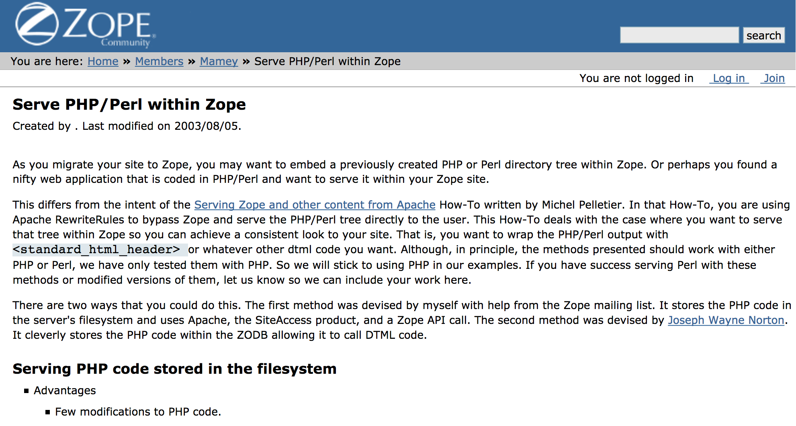

:title: Lessons Learned from other CMS & Wyh Universities love Open Source
:author: Alexander Loechel
:event: DrupalCamp 2016 - Munich
:keywords: Drupal, CMS, CMS-Garden, Plone, Zope, Community, History
:data-transition-duration: 400
:css-all: css/dcmuc2016.css
:auto-console: Yes

.. role:: slide-title-line1
    :class: line1

.. role:: slide-title-line2
    :class: line2

.. role:: slide-title-line3
    :class: line3

.. |br| raw:: html

     

.. |hr| raw:: html

    

.. |rarr| raw:: html

    &rarr;

.. role:: python(code)
   :class: highlight code python
   :language: python

.. role:: red

.. role:: green

----

:id: title
:class: slide lmu-slide title-slide lmu-title-slide level-1
:data-x: 0
:data-y: 0

.. class:: title

    Lessons Learned from other CMS

.. class:: subtitle

Why Universities Love Open Source

.. class:: referent

Alexander Loechel

.. note::

    Welcome to the LMU

    **Questions to Auditorium:**

    * Who among you know the CMS-Garden

    * Who among you know Zope and Plone?

----

:id: fossscience1
:class: slide lmu-slide level-1
:data-x: r-1500
:data-y: 1000

.. class:: slide-title

  :slide-title-line1:`Why Universities Love or Should Love Open Source`

Free & Open Source Software
===========================

Free & Open Source Software did have a strong tradition in the academia.

Licenses
--------

* GPL
* MIT
* BSD

.. note::

    * GPL (Richard Stallman - MIT - Massachusetts Institute of Technology )
    * MIT License (Massachusetts Institute of Technology - Cambridge/Boston)
    * BSD License (Berkeley Software Distribution - University of California - Berkeley)

----

:id: fossscience2
:class: slide lmu-slide level-1
:data-x: r+0
:data-y: r+1000

.. class:: slide-title

  :slide-title-line1:`Why Universities Love or Should Love Open Source`

Bases for Academic & Science
============================

Science, Research and therefor Academia are based on asking new questions on existing knowledge or observations

Keys of Science
---------------

* Transparent

  * Testing
  * Analysis
  * Replication

* Sharing of Knowledge and Review

  * recording and sharing
  * external review - peer review
  * replication

----

:id: fossscience3
:class: slide lmu-slide level-1
:data-x: r+0
:data-y: r+1000

.. class:: slide-title

  :slide-title-line1:`Why Universities Love or Should Love Open Source`

FOSS Principia - four essential freedoms
========================================

.. class:: fs26px

    0. The freedom to run the program as you wish, for any purpose.
    1. The freedom to **study** how the program works, and adapt it to your needs.
    2. The freedom to **redistribute copies** so you can help your neighbor.
    3. The freedom to **improve** the program, and **release** your improvements **to the public**, so that the whole community benefits.

.. container:: centered

    *Access to the source code is a precondition for this*

Science is based on existing Knowledge
======================================

* analyse
* discuss and have a discourse
* adapt and enhance
* redistribute & share

----

:id: fossscience4
:class: slide lmu-slide level-1
:data-x: r+0
:data-y: r+1000

.. class:: slide-title

  :slide-title-line1:`Why Universities Love or Should Love Open Source`

Academia: Science, Teaching and Research is about sharing and enhancing knowledge
=================================================================================

.. epigraph::

    Free software is a matter of liberty, not price. To understand the concept, you should think of “*free*” as in “*free speech*”, not as in “*free beer*”.

    -- What is Free Software - gnu.org

.. container:: centered

    Science and knowledge is not about the money |br|
    Freedom of Science is a high value

.. epigraph::

    Kunst und Wissenschaft, Forschung und Lehre sind frei.

    -- Art. 5 - Grundgesetz der Bundesrepublik Deutschland

.. note::

    Science and knowledge is not about the money |br|
    Freedom of Science is a high value and quite expensive

----

:id: ILU
:class: slide background-image-slide level-1
:data-x: r+0
:data-y: r+1000

.. container:: overlay

    .. image:: images/www.w3.org_TR_WD-ilu-requestor.png
        :width: 100px
        :class: right

    **Joint W3C/OMG Workshop on**
    **Distributed Objects and Mobile Code**

    *June 24-25, 1996*
    *Boston, Massachusetts*

    **Program Committee**

    .. image:: images/PaulEveritt.gif
        :width: 200px
        :class: right

    * Tim Berners-Lee, W3C
    * Dan Connolly, W3C
    * Paul Everitt, Digital Creations
    * ...
    * Guido van Rossum, CNRI
    * ...

    |rarr| The ILU Requester: Object Services in HTTP Servers

.. note::

    Also in 1996, someone else from Digital Creations participated in a joint
    W3C/OMG Working Group specifying modern object publishing on the web

    Paul Everitt

    https://www.youtube.com/watch?v=EgWb9z6i0dc

    The birth of Object Publishing in the Web

    Also Base for REST

----

:id: plone
:class: slide level-1
:data-x: r+0
:data-y: r+1000

.. container:: centered

    .. image:: images/logos/plone-logo.png
        :width: 600px
        :class: centered

    *First Released Version 0.1 on October 4, 2001*

.. note::

    Plone's first public release was on Oct. 4, 2001

----

:id: birthday
:class: slide background-image-slide level-1
:data-x: r+0
:data-y: r+1000

.. container:: overlay centered

    **Happy Birthday Plone**

    **15th Anniversary**

.. note::

    And Plone 5 was released last autumn.

    Now Plone is 15 years old. A teenager, almost grown up.

----

:id: not-framework
:class: slide background-image-slide level-1
:data-x: r+0
:data-y: r+1000

.. container:: overlay-b centered

    **CMS are not web frameworks**

.. note::

    I see quite often the perception that Plone is a web framework

    No, it is not a web framework

----

:id: cms
:class: slide background-image-slide level-1
:data-x: r+0
:data-y: r+1000

.. container:: overlay centered

    **CMS**

    *Content* *Management* *System*

.. note::

    Plone is a Content Management System

    Focus on **Management** system - most CMSs are web publishing systems

----

:id: intergration-framework
:class: slide background-image-slide level-1
:data-x: r+0
:data-y: r+1000

.. container:: overlay-b centered

    Plone is a |br| **Content Integration Framework**

    .. image:: images/multi-tool.png
        :width: 500px

.. container:: img-quote

    CC2-BY-SA https://en.wikipedia.org/wiki/File:Puzzle_Krypt-2.jpg

.. note::

    *Use the right tool for the job*

----

:id: traversal
:class: slide level-1
:data-x: r+0
:data-y: r+1000

Traversal
=========

.. container:: centered

    /site/folder/page

.. code:: python

    {'site': {'folder': {'page': page_object}}}

.. note::

    Look at this simple URL

    * This part of the URL is called the “path”. You can see that it looks a lot like a filesystem path.
    * Static web servers like Apache or Nginx serve static content by walking the filesystem, following these paths and returning the item at the end of the path as an HTTP response.
    * CGI, the dominant dynamic web technology of the early days, works the same way, except that the path ends in an executable script that generates HTTP headers and a response body.

    ... could we not, then, transform this filesystem hierarchy into a series of nested objects?

    Treating path segments like keys would allow us to walk the chain of contained objects just
    like walking a filesystem.

    Then, when the right object is found, what should we do with it?

----

:id: ttw-2
:class: slide level-1
:data-x: r+0
:data-y: r+1000

Zope2 - The Python Web Application Server
=========================================

.. note::

    Side Story:

    Python was not really that big at that time
    so Digital Creations paid $100.000 to build a Perl-runtime into Zope.
    ... and 2 people actually used it.
    In Zope you were even able to run Perl *and* PHP scripts.

    And Zope became very popular - not because of Perl and PHP - but because
     it allowed new developers to build powerful applications with only a browser.

    It lowered the bar to get started in web development.

----

:id: start-of-plone
:class: slide level-1
:data-x: r+0
:data-y: r+1000

.. image:: images/logos/plone-logo.png
    :width: 600px
    :class: centered
    :alt: Plone

.. container:: centered

    is about

    *User Experience*

    *User Interface*

    *Accessibility*

    **Empowering of Users**

.. note::

    Plone wraps the cool technical features of Zope and provides a nice user interface.

    After Plone's first public release in October 2001, it quickly gained users and mindshare.

----

:id: out-of-men
:class: slide background-image-slide level-1
:data-x: r+0
:data-y: r+1000

.. container:: overlay centered

    .. pull-quote::

        You can take the man out of Plone

        But you could not take the Plone out of the man

        -- Laurence Rowe - Plone Open Garden 2015 - Sorrento

.. note::

    Laurence said it right, even if community members leave

    * they might do other things but they still belong to the family
    * they still do the things the Plone way - reliable, approachable

----

:id: sprint
:class: slide background-image-slide level-1
:data-x: r+0
:data-y: r+1000

.. container:: overlay centered

    **Sprints**

    more than one sprint per month on average

    **Symposia**

    specific subgroups or areas

    * Plone Symposium East / Midwest (US university focus)
    * Plone Symposium South America (Brazil)
    * Plone Symposium Tokyo
    * Plone Open Gardens

.. note::

    Development usually happens in sprints. The term "sprint" was coined by the Zope community.

    In 2003 there was a sprint in a real castle in Austria,
    hosted by a real life prince. An Austrian TV crew was there reporting about the sprint.

    Back then it was still a weird thing that people would spend their free time
    and their own money to travel and work on something that they would then give away for
    free to people they didn't know.

    Nowadays when you read a bug report on GitHub it sometimes feels like everybody
    expects you to work for free to do their job.

    Last month we held a 15th anniversary sprint in the very same castle, with the very same prince.

----

:id: boring1
:class: slide level-1
:data-x: r+0
:data-y: r+1000

CMS are boring

----

:id: boring2
:class: slide level-1
:data-x: r+0
:data-y: r+1000

* MySQL is boring
* Postgres is boring
* :red:`PHP` is boring
* Apache httpd is boring
* LDAP is boring
* :red:`Python` is boring
* Memcached is boring
* Squid is boring
* Varnish is boring
* Cron is boring

----

:id: boring4
:class: slide background-image-slide level-1
:data-x: r+0
:data-y: r+1000

**"Boring"** should not be conflated with **"bad"**.

.. note::

    Boring does not mean "bad", but boring also does not mean "good"

    Python is a fantastic boring technology

    PHP is not that fantastic / or as bad as it once was

----

:id: boring3
:class: slide background-image-slide level-1
:data-x: r+0
:data-y: r+1000

.

    Every company gets about three innovation tokens.

    -- Dan McKinley, "Choose Boring Technology" http://mcfunley.com/choose-boring-technology

.. note::

    **Embrace Boredom.** -- Dan McKinley, "Choose Boring Technology"

    Let's say every company gets about three innovation tokens.
    You can spend these however you want, but the supply is fixed for a long while.
    You might get a few more after you achieve a certain level of stability and maturity,
    but the general tendency is to overestimate the contents of your wallet.
    Clearly this model is approximate, but I think it helps.

    If you choose to write your website in NodeJS,
    you just spent one of your innovation tokens.
    If you choose to use MongoDB, you just spent one of your innovation tokens.
    If you choose to use service discovery tech that's existed for a year or less,
    you just spent one of your innovation tokens.
    If you choose to write your own database, oh god, you're in trouble.

----

:id: boring5
:class: slide background-image-slide level-1
:data-x: r+0
:data-y: r+1000

**"Boring"** lets you get things *done*

----

:id: boring6
:class: slide background-image-slide level-1
:data-x: r+0
:data-y: r+1000

.. container:: overlay centered

    **"Boring"** pays your bills

----

:id: boring-question
:class: slide background-image-slide level-1
:data-x: r+0
:data-y: r+1000

.. container:: overlay centered

    But is a boring system interesting?

.. note::

    But is a boring system interesting?

    Essentially is it attractive to be involved and to attract new users and developers

----

:id: boring-answer
:class: slide background-image-slide level-1
:data-x: r+0
:data-y: r+1000

.. container:: overlay centered

    YES

----

:id: complex-systems
:class: slide background-image-slide level-1
:data-x: r+0
:data-y: r+1000

.. epigraph::

    A complex system that works is invariably found to have evolved from a simple system that worked.
    The inverse proposition also appears to be true:
    A complex system designed from scratch never works and cannot be made to work.
    You have to start over, beginning with a working simple system.

    -- "John Gall's law" - from "Systemantics: How Systems Really Work and How They Fail" - 1975

.. container:: img-quote

    CC3-BY-SA https://en.wikipedia.org/wiki/File:Tokyo_by_night_2011.jpg

.. note::

    A complex system that works is invariably found to have evolved from a simple system that worked.
    The inverse proposition also appears to be true:
    A complex system designed from scratch never works and cannot be made to work.
    You have to start over, beginning with a working simple system.

    -- "John Gall's law" - from "Systemantics: How Systems Really Work and How They Fail"

    “All software becomes legacy as soon as it's written.”

    -- Andrew Hunt & David Thomas, The Pragmatic Programmer

    "Inside every well-written large program is a well-written small program."

    -- Charles Antony Richard Hoare

----

:id: innovations
:class: slide background-image-slide level-1
:data-x: r+0
:data-y: r+1000

.. container:: overlay-b centered

    Innovation Driver

.. note::

    Geoffrey Moore, in his book,
    "Crossing the Chasm: Marketing and Selling High-tech Products to Mainstream Customers,"

----

:id: be-innovative
:class: slide background-image-slide level-1
:data-x: r+0
:data-y: r+1000

.. container:: overlay centered

    **"Boring"** lets you be innovative

    You could try new technologies

    Experiment with new approaches

    *But the system itself stays very conservative*

----

:id: step-learning-curve
:class: slide background-image-slide level-1
:data-x: r+0
:data-y: r+1000

.. container:: overlay centered

    Plone is **very complex**

    It has a *steep learning curve*

----

:id: hard
:class: slide background-image-slide level-1
:data-x: r+0
:data-y: r+1000

.. container:: overlay-b centered

    Plone is:

    * Hard

    * Complex

    * Complicated

.. note::

    Complaints that Plone is hard, complex and complicated and not very Pythonic

----

:id: zen
:class: slide background-image-slide level-1
:data-x: r+0
:data-y: r+1000

.. container:: overlay centered

    **The Zen of Python**

    .. code::

        >>> import this
        The Zen of Python, by Tim Peters

        Beautiful is better than ugly.
        Explicit is better than implicit.
        Simple is better than complex.
        Complex is better than complicated.
        Flat is better than nested.
        Sparse is better than dense.
        Readability counts.
        Special cases aren't special enough to break the rules.
        ...

.. note::

    PEP20 was also written with Zope in mind - Python should learn from the Mistakes of Zope

----

:id: zope-leads
:class: slide level-1
:data-x: r+0
:data-y: r+1000

.. pull-quote::

    Where Zope leads, Python follows

    -- Python community - around 2000

----

:id: master
:class: slide background-image-slide level-1
:data-x: r+0
:data-y: r+1000

.. container:: overlay centered

    *The difference between a master and a novice is that the master has failed more often than the novice has tried*

    You can move fast and break things, |br| if you know the procedure to repair it quickly

----

:id: overview
:data-x: 0
:data-y: 6000
:data-scale: 16
