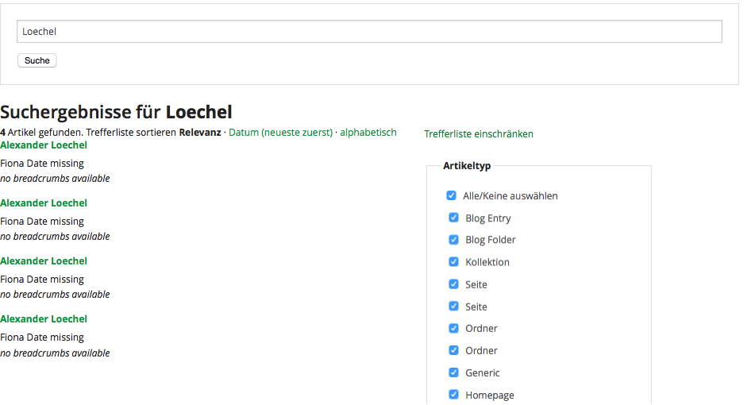
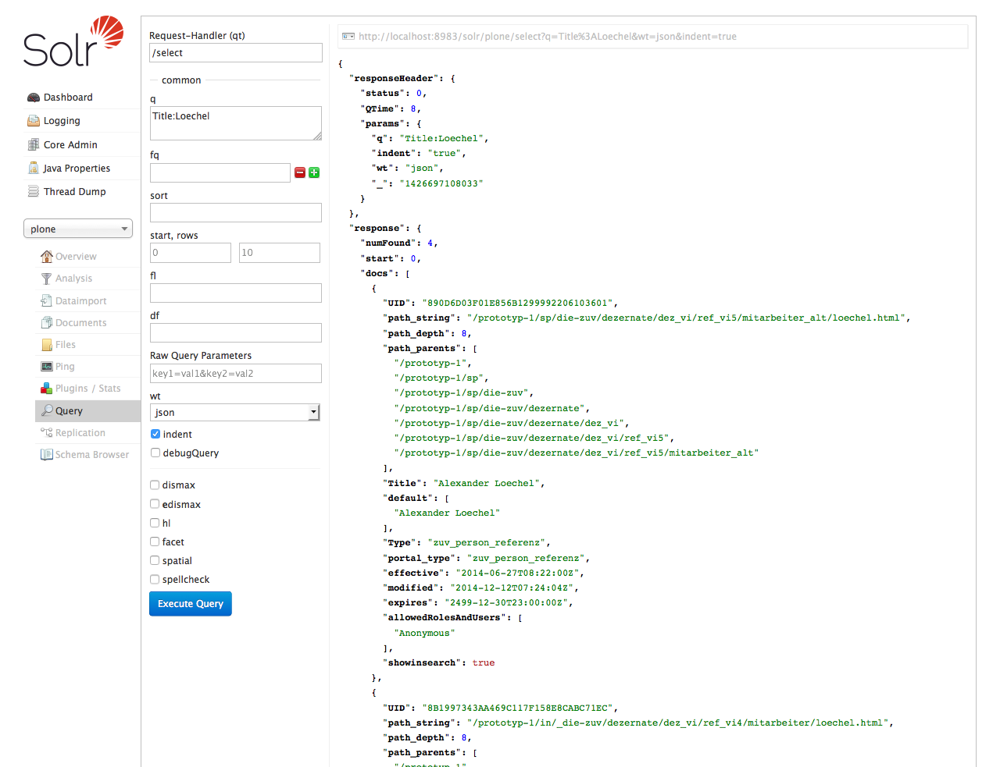

:title: Suche mit Solr für ein Fiona NPSOBJ
:author: Alexander Loechel
:event: Fiona User Group Lehre & Forschung Meeting 2015 - Uni Bayreuth
:keywords: Universitäten, Workshop, CMS Fiona, Solr
:data-transition-duration: 1500
:css-all: css/fiona-solr.css
:auto-console: Yes

.. role:: slide-title-line1
    :class: line1

.. role:: slide-title-line2
    :class: line2

.. role:: slide-title-line3
    :class: line3

.. |br| raw:: html

     

.. |hr| raw:: html

    

.. role:: python(code)
   :class: highlight code python
   :language: python

.. role:: tcl(code)
   :class: highlight code tcl
   :language: tcl

----

:id: title
:class: slide lmu-slide title-slide lmu-title-slide level-1
:data-x: 0
:data-y: 0

.. class:: title

Suche mit Solr für ein |br| Fiona NPSOBJ

.. class:: referent

Alexander Loechel |br|
Ludwig-Maximilians-Universität München

.. class:: subtitle

Fiona UG L&F - 19.03.2015 |br| an der Universität Bayreuth

.. note::

    * Test Note

----

:id: ablauf-generell
:class: slide lmu-slide level-1
:data-x: r-1500
:data-y: 1000

.. class:: slide-title

  :slide-title-line1:`Warum Solr und Fiona verknüpfen`

Warum Solr und Fiona?
=====================

* bisher nutzen wir für alle öffentlichen Auftritte: **Google Custom Search**

* großes Intra/Extranet Projekt

  * Zugriffsgeschützer Bereich
  * komplexe Struktur
  * lange Klickpfade

* interne Suche zwingend notwendig

----

:id: wie
:class: slide lmu-slide level-1
:data-x: r+0
:data-y: r+1000

.. class:: slide-title

  :slide-title-line1:`Anbindung Fiona an Solr`

Anbindung Fiona an Solr - Schreibend
====================================

* Einhängen an den **ExportFillCallback**
* Nur exportierte Inhalte in Solr

Anbindung Webseite an Solr - Lesend
===================================

----

:id: schema
:class: slide lmu-slide level-1
:data-x: r+1000
:data-y: 1000

.. class:: slide-title

  :slide-title-line1:`Solr Schema`

.. table::

    ==================== =========  =============  ==================  ================  ==============================
    Name                 Type       Indexed        Copyfield           Multivalued       Required / OmitNorms / Default
    ==================== =========  =============  ==================  ================  ==============================
    UID                  string                                                          r:true
    Title                text                      default
    physicalPath         string     false
    physicalDepth        integer    true
    parentPaths          string     true                               true
    default              text       true                               true              o:true
    Subject              string                    default             true
    Description          text                      default
    Creator              string
    Date                 date
    SearchableText       text                      default
    Type                 string
    allowedRolesAndUsers string                                        true              d:Anonymous
    created              date
    effective            date                                                            d:NOW
    expires              date                                                            d:2499-12-30T23:00:00.000Z
    modified             date
    portal_type          string
    review_state         string
    exclude_from_nav     boolean    false
    Language             string
    searchwords          string                                        true
    showinsearch         boolean                                                         d:True
    getRemoteUrl         string     false
    path_depth           integer    true
    path_parents         string     true                               true
    path_string          string     false
    ==================== =========  =============  ==================  ================  ==============================

----

:id: solrserver
:class: slide lmu-slide level-1
:data-x: r+0
:data-y: r+1000

.. class:: slide-title

  :slide-title-line1:`Solr Server`

----

:id: code-1
:class: slide lmu-slide level-1
:data-x: r+1000
:data-y: 1000

.. class:: slide-title

  :slide-title-line1:`Solr Scripte`

.. code:: tcl

    package require TclCurl
    namespace eval solr {
        namespace eval client {
            variable solrBaseUrl [nps::getText systemConfig \
                "wizards.solr.url" "http://localhost:8983/solr"]
            namespace import ::solr::helper::*

            # functions
        }
    }

.. code:: tcl

    # Schema Felder
    variable objectFields {
        UID
        Title
        path_string
        path_parents
        path_depth
        Type
        portal_type
        effective
        expires
        modified
        allowedRolesAndUsers
    }

----

:id: code-2
:class: slide lmu-slide level-1
:data-x: r+0
:data-y: r+1000

.. class:: slide-title

  :slide-title-line1:`Schreiben der Fiona Felder in die Solr-Felder`

.. code:: tcl

    proc default_obj_values {cms_path} {
        set standardAttribute [list validFrom validUntil name path title\
            objClass contentType id objType visiblePath permissionLiveServerRead lastChanged]
        if {[catch {obj withPath $cms_path get isExportable} isExportable]} {
            error "Connot read object $cms_path"

        } else {
            if {!$isExportable} {
                error "Not exportable"
                return [list "" ""]
            }
        }
        set index ""
        foreach $standardAttribute [eval [list obj withPath $cms_path mget] \
            $standardAttribute] {}
        lappend index "UID" [solr_id $cms_path]
        lappend index "Title" [prepare_text $title]
        # URL Parameter
        lappend index "path_string" $cms_path
        lappend index "path_depth" [helperGetPathDepth $cms_path]
        foreach pathElem [helperGetPathParents $cms_path] {
            lappend index "path_parents" $pathElem
        }
        # Faceting Parameter - Content Klasse und Datum
        lappend index "Type" $objClass
        lappend index "portal_type" $objClass
        lappend index "effective" [solr_date $validFrom]
        lappend index "expires" [solr_date $validUntil]
        lappend index "modified" [solr_date $lastChanged]
        # Rechte Begrenzung für Suche
        foreach role [helperLineToList $permissionLiveServerRead] {
            lappend index "allowedRolesAndUsers" $role
        }
        return $index
    }

----

:id: code-3
:class: slide lmu-slide level-1
:data-x: r+1000
:data-y: 1000

.. class:: slide-title

  :slide-title-line1:`Fiona commit hook`

.. code:: tcl

            proc post {content {core ""}} {
                set solrUrl [solrActionUrl $core]
                set httpHeaders [list]
                lappend httpHeaders "Content-Type: application/xml"
                set httpBody ""
                logMessage 2  "POST DATA TO SOLR ($core): $content"

                if {![catch {::curl::transfer -url $solrUrl -post 1 \
                    -postfields $content \
                    -httpheader $httpHeaders  \
                    -bodyvar httpBody} response]} {

                    foreach {match status} [regexp -inline {<int name="status">(.*?)</int>} $httpBody] {}
                    if {[info exist match]} {
                        # write_log "\tSolr-Status: $status $httpBody"
                    } else {
                        write_log $content
                        write_log "\tSolr-Error: $httpBody"
                    }
                } else {
                    write_log "\tSolr-Error: no connection to solr"
                }
            }

            proc commit {{backup 0}} {
                foreach core [get_cores] {
                    post "<commit/>" $core
                    post "<optimize/>" $core
                    if {$backup} {
                        if {[catch {::curl::transfer -url \
                            [solrActionUrl $core "replication?command=backup"]} result]} {
                            write_log "\tSolr-Error: no connection on commit"
                        }
                    }
                }
            }

----

:id: code-4
:class: slide lmu-slide level-1
:data-x: r+0
:data-y: r+1000

.. class:: slide-title

  :slide-title-line1:`Solr Schema`

.. code:: tcl

    proc helperGetPathParents {cms_path} {
        set parts [split $cms_path "/"]
        set maxNumParts [llength $parts]
        set pathList [list]
        set tmpValue "/"
        for {set i 1} {$i < [expr $maxNumParts - 1]} {incr i 1} {
            append tmpValue "[lindex $parts $i]/"
            lappend pathList [string trimright $tmpValue "/"]
        }
        return $pathList
    }

    proc helperGetPathDepth {cms_path} {
        return [expr [llength [split $cms_path "/"]] -2 ]
    }

    proc helperLineToList {lines} {
        return [split $lines "\n"]
    }

----

:id: overview
:data-x: 0
:data-y: 1000
:data-scale: 4

