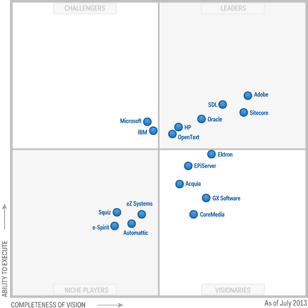
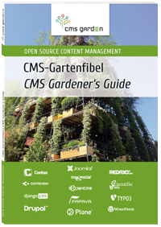

----

:id: ablauf-dienstag
:class: slide level-1
:data-x: r+0
:data-y: r+1000

Ablauf und Themen
=================

Dienstag
--------

* Einführung
* Prozess und Sessions
* Vorstellungsrunde der Teilnehmer
* Aktueller Stand von Plone

  * Marktposition
  * Stand der Wettbewerber

* Bericht der Plone Foundation

  * Mitglieder & Team Berichte
  * Ergebnisse von Community-Umfragen

----

:id: ablauf-mittwoch
:class: slide level-1
:data-x: r+0
:data-y: r+1000

Ablauf und Themen
=================

Mittwoch
--------

"keeping up with the Joneses" / Technologische Zukunft

* Backend

  * Weiterführung der Roadmap 2020 Diskussion
  * Backend API
  * Wie geht es weiter mit Zope / Python 3

* Frontend

  * JavaScript Interface
  * Trennung von Backend und Frontend
  * Multi Channel Anbindung

----

:id: ablauf-donnerstag
:class: slide level-1
:data-x: r+0
:data-y: r+1000

Ablauf und Themen
=================

Donnerstag
----------

"provider ecosystem, marketing & positioning"

* Lessons learnd vom Intranet Consortium Projekt
* Unterschiede in der Marktsituation weltweit
* Plone Marekting

* Diskussion Plone TTW Zukunft

----

:id: ablauf-freitag
:class: slide level-1
:data-x: r+0
:data-y: r+1000

Ablauf und Themen
=================

Freitag
-------

approachability & community

* Wie kann man Plone einfacher machen
* Wie kann man einen schneller Einstieg und Ausprobieren ermöglichen
* Wie kann man neue Entwickler für Plone interessieren

----

:id: ablauf-samstag
:class: slide level-1
:data-x: r+0
:data-y: r+1000

Ablauf und Themen
=================

Samstag
-------

----

:id: rsg2008
:class: slide level-1
:data-x: r+0
:data-y: r+1000
:data-z: -20

----

:id: rsg2013
:class: slide level-1
:data-x: r+0
:data-y: r+0
:data-z: -10
:data-transition-duration: 150

----

:id: rsg2015
:class: slide level-1
:data-x: r+0
:data-y: r+0
:data-z: 0
:data-transition-duration: 150

----

:id: fired
:class: slide level-1
:data-x: r+0
:data-y: r+1000
:data-transition-duration: 1500

.. container:: overlay

    No One gets fired for hiring IBM / Cisco

----

:id: cms-garden
:class: slide level-1
:data-x: r+0
:data-y: r+1000

.. container:: overlay-b

    Plone ist Teil des CMS-Garden |br|
    Vorteile für die Community

    * Austausch über generell Bedürfnisse bei CMS
    * Lernen aus den Fehlern anderer
    * Überblick über alle relevanten Open Source CMS

