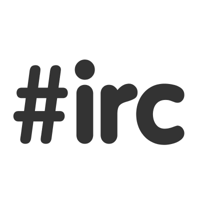

:title: Plone & Python Community - A Long Journey
:author: Alexander Loechel & Philip Bauer
:event: PyCon.DE 2016
:keywords: Plone, Zope, Python, Community, History, Keynote
:data-transition-duration: 1500
:css-all: css/plone-python-community.css
:auto-console: Yes

.. role:: slide-title-line1
    :class: line1

.. role:: slide-title-line2
    :class: line2

.. role:: slide-title-line3
    :class: line3

.. |br| raw:: html

     

.. |hr| raw:: html

    

.. |rarr| raw:: html

    &rarr;

.. role:: python(code)
   :class: highlight code python
   :language: python

.. role:: red

.. role:: green

----

:id: title
:class: slide title-slide level-1
:data-x: 0
:data-y: 0

.. class:: title

.. container:: centered

    &

    .. image:: images/logos/plone-logo.png
        :height: 90px
        :class: left

    .. image:: images/logos/python-logo.png
        :height: 90px
        :class: right

Community
=========

A Long Journey
--------------

.. container:: centered

    A History of Community, Technology and the Web

    Alexander Loechel & Philip Bauer

----

:id: history
:class: slide level-1
:data-x: r-3000
:data-y: r+1000

Ancient History
===============

.. note::

    Alexander / Philip

----

:id: python
:class: slide background-image-slide level-1
:data-x: r+0
:data-y: r+1000

.. container:: overlay centered

    .. image:: images/logos/python-logo.png
        :height: 180px

    *20. February 1991*

.. note::

    Alexander

    The Beginning: Python

----

:id: bobo
:class: slide background-image-slide level-1
:data-x: r+0
:data-y: r+1000

.. container:: overlay centered

    .. image:: images/Jim-Fulton.jpg
        :width: 350px
        :class: right

    **BOBO**

    *1996*

.. note::

    Zope was Born

    Zope == Z Object Publishing Environment

    background-image: images/flight-seat.jpg

----

:id: zope
:class: slide level-1
:data-x: r+0
:data-y: r+1000

.. container:: centered

    The Idea of Zope and ZODB are from 1996

.. note::

    Zope was Born

    Zope == Z Object Publishing Environment
    ZODB == Z Object Database

----

:id: ILU
:class: slide background-image-slide level-1
:data-x: r+0
:data-y: r+1000

.. container:: overlay

    .. image:: images/www.w3.org_TR_WD-ilu-requestor.png
        :width: 100px
        :class: right

    **Joint W3C/OMG Workshop on**
    **Distributed Objects and Mobile Code**

    *June 24-25, 1996*
    *Boston, Massachusetts*

    **Program Committee**

    * Tim Berners-Lee, W3C
    * Dan Connolly, W3C
    * Paul Everitt, Digital Creations
    * ...
    * Guido van Rossum, CNRI
    * ...

    |rarr| The ILU Requester: Object Services in HTTP Servers

.. note::

    https://www.youtube.com/watch?v=EgWb9z6i0dc

    The birth of Object Publishing in the Web

    Also Base for REST

----

:id: floppy
:class: slide level-1
:data-x: r+0
:data-y: r+1000

.. image:: images/zope-floppy.jpg
    :height: 600px
    :class: centered

.. note::

    Venture Capital $14M in late 90's

    Sell for 20.000 US$ each

----

:id: zope-corp
:class: slide background-image-slide level-1
:data-x: r+0
:data-y: r+1000

.. container:: overlay

    **Digital Creations, L.C.** *later become* **Zope Corporation**

    Employees

    * Jim Fulton
    * Paul Everitt
    * Tres Seaver
    * Chris McDonough
    * Guido van Rossum
    * ...

.. note::

    Alexander

    Background-image zope-corp

----

:id: irc
:class: slide level-1
:data-x: r+0
:data-y: r+1000

.. image:: images/limi.jpg
    :height: 330px
    :class: left

.. container:: centered

    Alex Limi   *1999*   Alan Runyan

.. note::

    Alexander

    In 1999 Two People (Alex Limi & Alan Runyan) met on IRC and talk about Music and Web Programming

----

:id: plone
:class: slide level-1
:data-x: r+0
:data-y: r+1000

.. container:: centered

    .. image:: images/logos/plone-logo.png
        :width: 600px
        :class: centered

    *First Released Version 0.1 on 4. October 2001*

.. note::

    Alexander

    Plone was releaser on Oct. 04 2001 |rarr| Plone is now 15 years old.

    And while Zope was the killer app on Python, Plone became the killer app on Zope.

----

:id: birthday
:class: slide background-image-slide level-1
:data-x: r+0
:data-y: r+1000

.. container:: overlay centered

    **Happy Birthday Plone**

    **15th Anniversary**

.. note::

    icons should be plone-birthday-sticker.png

    Alexander

----

:id: what
:class: slide level-1
:data-x: r+1000
:data-y: 1000

But what is Plone?
==================

.. note::

    Philip

----

:id: wikipedia-theme
:class: slide background-image-slide level-1
:data-x: r+0
:data-y: r+1000

.. note::

    Wikipedia Theme
    MediaWiki's "Monobook" layout is based partially on the Plone style sheets.

    Mediawiki 'monobook' style sheet for CSS2-capable browsers.
    Copyright Gabriel Wicke - http://wikidev.net/
    License: GPL

    Loosely based on http://www.positioniseverything.net/ordered-floats.html by Big John
    and the Plone 2.0 styles, see http://plone.org/ (Alexander Limi, Joe Geldart & Tom Croucher,
    Michael Zeltner and Geir Bækholt)
    All you guys rock :)

----

:id: classic-theme
:class: slide background-image-slide level-1
:data-x: r+0
:data-y: r+1000

.. note::

    Plone Classic Theme

    Side-Kick: Wikipedia Theme

----

:id: sunburst-theme
:class: slide background-image-slide level-1
:data-x: r+0
:data-y: r+1000

.. note::

    Philip

    Plone Sunburst Theme

----

:id: barceloneta-theme
:class: slide background-image-slide level-1
:data-x: r+0
:data-y: r+1000

.. note::

    Philip

    Plone barceloneta Theme

----

:id: tech
:class: slide level-1
:data-x: r+0
:data-y: r+1000

Technology
==========

.. note::

    Philip

----

:id: traversal
:class: slide level-1
:data-x: r+0
:data-y: r+1000

Traversal
=========

----

:id: traversal-explained
:class: slide level-1
:data-x: r+0
:data-y: r+1000

Technology
==========

.. note::

    Philip

----

:id: giants
:class: slide background-image-slide level-1
:data-x: r+0
:data-y: r+1000

We are standing on the shoulder of giants

.. note::

    Alexander / Philip

    Background-image Giants

----

:id:
:class: slide level-1
:data-x: r+0
:data-y: r+1000

Lightning Talks
===============

.. note::

    Philip

    background image Lightning-Talk List

----

:id:
:class: slide level-1
:data-x: r+0
:data-y: r+1000

Sprints
=======

.. note::

    Philip

    background image Sprint boston

----

:id:
:class: slide level-1
:data-x: r+0
:data-y: r+1000

2003 founding of Plone Foundation

Some Officers and Board Members:
* Paul Everitt
* Alex Limi
* Alan Runyan
* Matt Hamilton
* Joel Burton

.. note::

    Alexander

----

:id:
:class: slide level-1
:data-x: r+0
:data-y: r+1000

Founding of the Python Software Foundation

Bootstraped by

* Paul Everitt

.. note::

    Alexander

----

:id:
:class: slide level-1
:data-x: r+0
:data-y: r+1000

.. note::

    Alexander / Philip

----

:id:
:class: slide level-1
:data-x: r+0
:data-y: r+1000

.. note::

    Alexander / Philip

----

:id:
:class: slide level-1
:data-x: r+0
:data-y: r+1000

.. note::

    Alexander / Philip

----

:id:
:class: slide level-1
:data-x: r+0
:data-y: r+1000

.. note::

    Alexander / Philip

    Ideen Pool Complains

----

:id: complains
:class: slide level-1
:data-x: r+1000
:data-y: 1000

Complains
=========

.. note::

    Alexander

    We do hear and get a lot of complains about Plone

----

:id: hip
:class: slide level-1
:data-x: r+0
:data-y: r+1000

Plone is not hip, anymore

.. note::

    Alexander

----

:id: boring1
:class: slide level-1
:data-x: r+0
:data-y: r+1000

Plone is boring

.. note::

    Alexander

----

:id: boring2
:class: slide level-1
:data-x: r+0
:data-y: r+1000

* MySQL is boring
* Postgres is boring
* PHP is boring
* Apache httpd is boring
* LDAP is boring
* :red:`Python` is boring
* Memcached is boring
* Squid is boring
* Varnish is boring
* Cron is boring

.. note::

    Alexander

----

:id: boring3
:class: slide background-image-slide level-1
:data-x: r+0
:data-y: r+1000

.

    Every company gets about three innovation tokens.

    -- Dan McKinley, "Choose Boring Technology" http://mcfunley.com/choose-boring-technology

.. note::

    Alexander

    **Embrace Boredom.** -- Dan McKinley, "Choose Boring Technology"

    Let's say every company gets about three innovation tokens.
    You can spend these however you want, but the supply is fixed for a long while.
    You might get a few more after you achieve a certain level of stability and maturity,
    but the general tendency is to overestimate the contents of your wallet.
    Clearly this model is approximate, but I think it helps.

    If you choose to write your website in NodeJS,
    you just spent one of your innovation tokens.
    If you choose to use MongoDB, you just spent one of your innovation tokens.
    If you choose to use service discovery tech that's existed for a year or less,
    you just spent one of your innovation tokens.
    If you choose to write your own database, oh god, you're in trouble.

----

:id: boring4
:class: slide background-image-slide level-1
:data-x: r+0
:data-y: r+1000

"Boring" should not be conflated with "bad."

.. note::

    Alexander

----

:id: boring5
:class: slide background-image-slide level-1
:data-x: r+0
:data-y: r+1000

Boring let you get things done

.. note::

    Alexander

----

:id: boring6
:class: slide background-image-slide level-1
:data-x: r+0
:data-y: r+1000

Boring pays your bills

.. note::

    Alexander

----

:id: boring-question
:class: slide background-image-slide level-1
:data-x: r+1000
:data-y: 2000

.. container:: overlay centered

    But is a boring System interesting?

.. note::

    Alexander

----

:id: boring-answer
:class: slide background-image-slide level-1
:data-x: r+0
:data-y: r+1000

.. container:: overlay centered

    YES

.. note::

    Alexander

----

:id: complex-systems
:class: slide background-image-slide level-1
:data-x: r+0
:data-y: r+1000

.

    A complex system that works is invariably found to have envolved from a simple system that worked.
    A complex system designed from scratch never works and cannot be patched up to make it work.
    You have to start over with a working simple system.

    -- Jon Gall

.. container:: img-quote

    CC3-BY-SA https://en.wikipedia.org/wiki/File:Tokyo_by_night_2011.jpg

.. note::

    Alexander

    A complex system that works is invariably found to have envolved from a simple system that worked.
    A complex system designed from scratch never works and cannot be patched up to make it work.
    You have to start over with a working simple system.

    -- Jon Gall

    “All software becomes legacy as soon as it's written.”

    -- Andrew Hunt & David Thomas, The Pragmatic Programmer

    "Inside every well-written large program is a well-written small program."

    -- Charles Antony Richard Hoare

----

:id: innovations
:class: slide background-image-slide level-1
:data-x: r+0
:data-y: r+1000

.. container:: overlay-b centered

    Innovation Driver

----

:id: step-learning-curve
:class: slide background-image-slide level-1
:data-x: r+1000
:data-y: 2000

.. container:: overlay centered

    Plone is very complex

    step learning curve

.. note::

    Alexander / Philip

----

:id: hard
:class: slide background-image-slide level-1
:data-x: r+0
:data-y: r+1000

.. container:: overlay-b centered

    Plone is:

    * Hard

    * complex

    * Complicated

.. note::

    Alexander

    Complains about Plone is Hard, Complex and Complicated and not very Pythonic

----

:id: innovations2
:class: slide background-image-slide level-1
:data-x: r+0
:data-y: r+1000

.. container:: overlay-b centered

    Innovation Driver

.. note::

    Alexander

    Repeat - Plone is an Innovation Driver

    Plone has been there long before the current Practices become Standard

----

:id: old-style
:class: slide level-1
:data-x: r+0
:data-y: r+1000

Old-Style Code
==============

=======================   ==================
Zope/Plone                Python Standard
=======================   ==================
:python:`zope.DateTime`   :python:`datetime`
=======================   ==================

----

Ideen Pool Future / Roadmap

----

:id:
:class: slide level-1
:data-x: r+0
:data-y: r+1000

.. code:: Python

    from __future__ import feature

.. note::

    Philip

    Plone model of introducing features

    New major Features will be developed as add-ons first and mature for a while before they go into core

    Examples:

    * Dexterity
    * Dizao
    * Mosaic

    * plone.restapi

----

:id: diazo
:class: slide level-1
:data-x: r+0
:data-y: r+1000

Diazo
=====

.. image:: images/diazo-concept.png
    :width: 600px
    :class: centered
    :alt: Diazo

.. note::

    Philip

----

#:id:
:class: slide level-1
:data-x: r+0
:data-y: r+1000

.. code:: Python

    from __future__ import feature

.. note::

    Philip

----

:id: zen
:class: slide background-image-slide level-1
:data-x: r+0
:data-y: r+1000

.. container:: overlay centered

    **The Zen of Python**

    .. code::

        >>> import this
        The Zen of Python, by Tim Peters

        Beautiful is better than ugly.
        Explicit is better than implicit.
        Simple is better than complex.
        Complex is better than complicated.
        Flat is better than nested.
        Sparse is better than dense.
        Readability counts.
        Special cases aren't special enough to break the rules.
        ...

.. note::

    Alexander

----

:id: community
:class: slide background-image-slide level-1
:data-x: r+0
:data-y: r+1000

.. container:: overlay centered timed

    *It is about how you act*

    **Every contribution counts**

    * Code
    * Bug Reports
    * Documentation
    * Translations
    * Marketing
    * ...

    *Welcoming new Persons to the Community*

.. note::

    **Plone Conference 2012 Arnheim**

    de meeste mensen zwijgen, een enkeling stelt een daad. - Die meisten Menschen schwiegen, ein paar wenige handeln.

    Alexander

----

:id: success
:class: slide background-image-slide level-1
:data-x: r+0
:data-y: r+1000

.. container:: overlay centered

    **Surround yourself with the right people**

    * People smarter than you
    * People that you look up to
    * People that help you
    * People that want you to get ahead
    * People that get you out of your comfort zone
    * People that make you smile

.. note::

    Alexander

----

:id: intergration-framework
:class: slide background-image-slide level-1
:data-x: r+0
:data-y: r+1000

.. container:: overlay-b centered

    Plone is a |br| **Content Integration Framework**

.. container:: img-quote

    CC2-BY-SA https://en.wikipedia.org/wiki/File:Puzzle_Krypt-2.jpg

.. note::

    *Use the right tool for the job*

    Alexander

----

:id: turnaround
:class: slide level-1
:data-x: r+0
:data-y: r+1000

.

    rapid turnaround:

    VITAL

    -- Sean Kelly - Better Web-Application Development |br| https://www.youtube.com/watch?v=DWODIO6aCUE

.. note::

    Alexander

----

:id: master
:class: slide background-image-slide level-1
:data-x: r+0
:data-y: r+1000

.. container:: overlay centered

    *The difference between a master and a novice is, that the master has failed more often than the novice has tried*

    You can move fast and break things, |br| if you know the procedure to repair it quickly

.. note::

    Alexander

----

:id:
:class: slide level-1
:data-x: r+0
:data-y: r+1000

Plone is the First Class Citizen of Content Management and Python Web

.. note::

    Alexander

----

:id: continue
:class: slide level-1
:data-x: r+0
:data-y: r+1000

The Journey Continues

Plone Roadmap 2020
==================

*
*
*

.. note::

    Philip

----

:id: cu
:class: slide level-1
:data-x: r+1000
:data-y: 1000

Onboard the Plone Community and join the journey

See you at

* Plone Open Garden 2017 - Sorrento - Italiy - Date
* PloneConf 2017 Barcelona - Catalunia - Date
* or any Sprint or Event, ...

.. note::

    Philip

----

:id: overview
:data-x: 0
:data-y: 5000
:data-scale: 13
