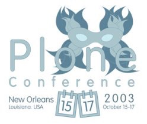
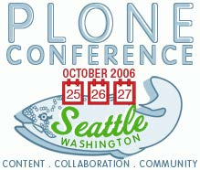
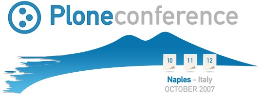

:title: Plone & Python Community - A Long Journey
:author: Alexander Loechel
:event: PyCon.DE 2016
:keywords: Plone, Zope, Python, Community, History, Keynote
:data-transition-duration: 400
:css-all: css/plone-python-community.css
:auto-console: Yes

.. role:: slide-title-line1
    :class: line1

.. role:: slide-title-line2
    :class: line2

.. role:: slide-title-line3
    :class: line3

.. |br| raw:: html

     

.. |hr| raw:: html

    

.. |rarr| raw:: html

    &rarr;

.. role:: python(code)
   :class: highlight code python
   :language: python

.. role:: red

.. role:: green

----

:id: title
:class: slide title-slide level-1
:data-x: 0
:data-y: 0

.. class:: title

.. container:: centered

    .. image:: images/logos/zope-logo.png
        :height: 70px

    .. image:: images/logos/plone-logo.png
        :height: 70px

    .. image:: images/logos/python-logo.png
        :height: 70px

Community
=========

A Long Journey
--------------

.. container:: centered

    A History of Community, Technology and the Web

    Alexander Loechel

.. note::

    First of all I want to thank you for the honour to be giving the opening keynote at PyCon.DE 2016 in Munich!

    Welcome to the LMU

    I have worried about giving the keynote - I am neither the president of the Plone Foundation
    nor the Release Manager. I am not among the smartest persons in the Plone community.

    A lot of other fabulous community members are now sitting here in front of me and might have given a better and
    more interesting technical talk.

    I am just a messenger who was asked to talk about our awesome community.

    So I started to prepare this keynote, as I was requested to speak about
    Plone and the general Python community.

    But I realized that, due to a large overlap in our communities and lots of joint efforts between them,
    this talk must be about the history of Zope and Plone
    in relation to the general Python community.

    **Questions to Auditorium:**

    * Who among you know Zope and Plone?
    * How many people from either community are here today?
    * How many of you have ever contributed to:

      * Plone?
      * Zope?

----

:id: history
:class: slide level-1
:data-x: r-5500
:data-y: r+1000

Ancient History
===============

.. note::

    So we want to speak about ancient history first to see the origins of Plone and its community

----

:id: python
:class: slide background-image-slide level-1
:data-x: r-500
:data-y: r+1000

.. container:: overlay centered

    .. image:: images/logos/python-logo.png
        :height: 180px

    *20. February 1991*

.. note::

    Our history begins with Python, a Christmas project in 1990 by
    Guido van Rossum, who was playing around and trying to define a new teaching language inspired by ABC

    Fast Forward

----

:id: bobo
:class: slide background-image-slide level-1
:data-x: r+0
:data-y: r+1000

.. container:: overlay centered

    .. image:: images/Jim-Fulton.jpg
        :width: 350px
        :class: right

    **BOBO**

    *1996*

.. note::

    The year is 1996.

    This man, the CTO of Digital Creations in Fredericksburg, VA
    is on a plane to the International Python Conference in California.
    Jim is scheduled to give a tutorial about CGI programming
    and so he spends the flight learning the specification.

    He’s got some ideas about how to improve it,
    and on the flight home he designs what would become Bobo,
    the first Python / Web Object Publishing System.

----

:id: ILU
:class: slide background-image-slide level-1
:data-x: r+0
:data-y: r+1000

.. container:: overlay

    .. image:: images/www.w3.org_TR_WD-ilu-requestor.png
        :width: 100px
        :class: right

    **Joint W3C/OMG Workshop on**
    **Distributed Objects and Mobile Code**

    *June 24-25, 1996*
    *Boston, Massachusetts*

    **Program Committee**

    .. image:: images/PaulEveritt.gif
        :width: 200px
        :class: right

    * Tim Berners-Lee, W3C
    * Dan Connolly, W3C
    * Paul Everitt, Digital Creations
    * ...
    * Guido van Rossum, CNRI
    * ...

    |rarr| The ILU Requester: Object Services in HTTP Servers

.. note::

    Also in 1996, someone else from Digital Creations participated in a joint
    W3C/OMG Working Group specifying modern object publishing on the web

    Paul Everitt

    https://www.youtube.com/watch?v=EgWb9z6i0dc

    The birth of Object Publishing in the Web

    Also Base for REST

----

:id: floppy
:class: slide level-1
:data-x: r+0
:data-y: r+1000

.. note::

    Bobo had a commercial twin: Principia.

    Digital Creations was asked to sell Principia to the US Navy for 20.000 US$

    So they put it on a floppy, but that looked too cheap, so they decided to burn it onto a CD,
    even though the floppy had more than enough space despite also containing the Python interpreter!

----

:id: zope
:class: slide level-1
:data-x: r+0
:data-y: r+1000

.. image:: images/logos/zope-logo.png
    :width: 500px
    :class: centered

.. note::

    Digital Creations received a large venture capital investment of $750K in the late 90's

    In 1998, the largest investor in Digital Creations convinced the CEO Paul Everitt
    to release the Principia software as open source.

    Principia and Bobo became the Z Object Publishing Environment. In 1999 Zope was born.

----

:id: zope-corp
:class: slide background-image-slide level-1
:data-x: r+0
:data-y: r+1000

.. container:: overlay

    **Digital Creations, L.C.** *later became* **Zope Corporation**

    Employees

    * Jim Fulton
    * Paul Everitt
    * Tres Seaver
    * Chris McDonough
    * Guido van Rossum
    * Barry Warsaw
    * Jeremy Hylton
    * Fred Drake
    * Tim Peters
    * ...

.. note::

    Digital Creations was later renamed Zope Corporation.

    Zope Corp hired PythonLabs when the startup that hosted them went under.

----

:id: zope-corp2
:class: slide background-image-slide level-1
:data-x: r+0
:data-y: r+1000

.. note::

    That was Guido van Rossum, Barry Warsaw, Jeremy Hylton, Fred Drake and Tim Peters.

    And this is how Guido's slides looked at that time.

    They paid their salary for 3 years to have them working on Python.
    I'd say that was a solid contribution to the Python community.
    No regrets there.

----

:id: irc
:class: slide level-1
:data-x: r+1000
:data-y: 2000

.. image:: images/logos/irc-logo.png
    :height: 100px
    :class: centered

.. image:: images/runyan.jpg
    :height: 330px
    :class: right

.. container:: centered

    Alex Limi   *1999*   Alan Runyan

.. note::

    In 1999, two people (Alex Limi & Alan Runyan) met on IRC and talked about music and web programming

    They looked around, found Zope, and started to build on top of this a CMS.

----

:id: plone
:class: slide level-1
:data-x: r+0
:data-y: r+1000

.. container:: centered

    .. image:: images/logos/plone-logo.png
        :width: 600px
        :class: centered

    *First Released Version 0.1 on October 4, 2001*

.. note::

    Plone's first public release was on Oct. 4, 2001

----

:id: birthday
:class: slide background-image-slide level-1
:data-x: r+0
:data-y: r+1000

.. image:: images/icons/anniversary-sticker.png
    :width: 200px
    :class: left

.. image:: images/icons/anniversary-sticker.png
    :width: 200px
    :class: right

.. container:: overlay centered

    **Happy Birthday Plone**

    **15th Anniversary**

.. note::

    And Plone 5 was released last autumn.

    Now Plone is 15 years old. A teenager, almost grown up.

----

:id: what
:class: slide level-1
:data-x: r+3500
:data-y: 1000

What is
=======

.. image:: images/logos/plone-logo.png
    :width: 600px
    :class: centered

and why is it still around?
---------------------------

.. note::

    The question you might ask yourself: why is Plone still around?
    While there may be many answers to this question I will focus on two of them:

    Technology and Community

    Let's first talk a little about technology.

    But start with what Plone is not.

----

:id: technology
:class: slide level-1
:data-x: r-1500
:data-y: 2000

Technology
==========

----

:id: not-framework
:class: slide background-image-slide level-1
:data-x: r-1000
:data-y: 3000

.. container:: overlay-b centered

    **Plone is not a web framework**

.. note::

    I see quite often the perception that Plone is a web framework

    No, it is not a web framework

----

:id: cms
:class: slide background-image-slide level-1
:data-x: r+0
:data-y: r+1000

.. container:: overlay centered

    **CMS**

    *Content* *Management* *System*

.. note::

    Plone is a Content Management System

    Focus on **Management** system - most CMSs are web publishing systems

----

:id: intergration-framework
:class: slide background-image-slide level-1
:data-x: r+0
:data-y: r+1000

.. container:: overlay-b centered

    Plone is a |br| **Content Integration Framework**

    .. image:: images/multi-tool.png
        :width: 500px

.. container:: img-quote

    CC2-BY-SA https://en.wikipedia.org/wiki/File:Puzzle_Krypt-2.jpg

.. note::

    *Use the right tool for the job*

----

:id: adaptation
:class: slide background-image-slide level-1
:data-x: r+0
:data-y: r+1000

.. container:: overlay-b centered

    **Adaptation**

    *Best of Breed*

.. note::

    It is a question of adaptation

    In business this is often called Best of Breed selection

    You choose a technology or modification to optimize your needs / requirements

----

:id: zope2
:class: slide level-1
:data-x: r+1000
:data-y: 3000

.. image:: images/logos/zope-logo.png
    :width: 500px
    :class: centered

----

:id: traversal-1
:class: slide level-1
:data-x: r+0
:data-y: r+1000

Traversal
=========

.. container:: centered

    /site/folder/page

.. note::

    Look at this simple URL

    * This part of the URL is called the “path”. You can see that it looks a lot like a filesystem path.
    * Static web servers like Apache or Nginx serve static content by walking the filesystem, following these paths and returning the item at the end of the path as an HTTP response.
    * CGI, the dominant dynamic web technology of the early days, works the same way, except that the path ends in an executable script that generates HTTP headers and a response body.

----

:id: traversal-2
:class: slide level-1
:data-x: r+0
:data-y: r+1000

ZODB
----

.. code:: python

    import transaction

    from ZODB import DB
    from ZODB import FileStorage

    connection = DB(FileStorage.FileStorage('./Data.fs')).open()
    root = connection.root()

    root['a_number'] = 3
    root['a_string'] = 'Conference'
    root['a_dict'] = {
        '09:45': 'Plone & Python Community - Keynote',
        '10:45': 'Break',
        ...
    }

    transaction.commit()
    connection.close()

.. note::

    Jim Fulton, on that airplane ride back in ’96, asked himself a question:
    “Could we treat Python objects the same way?"

    If we have a database that allows us to store Python objects (the ZODB),

    and we combine that with objects that can behave like Python dicts,

----

:id: traversal-explained-3
:class: slide level-1
:data-x: r+0
:data-y: r+1000

.. code:: python

    {'site': {'folder': {'page': page_object}}}

.. note::

    ... could we not, then, transform this filesystem hierarchy into a series of nested objects?

    Treating path segments like keys would allow us to walk the chain of contained objects just
    like walking a filesystem.

    Then, when the right object is found, what should we do with it?

----

:id: object-publishing
:class: slide level-1
:data-x: r+0
:data-y: r+1000

Object Publishing
=================

.. code:: python

    def publish(request, module_name, after_list, debug=0
                # Optimize:
                call_object=call_object,
                missing_name=missing_name,
                dont_publish_class=dont_publish_class,
                mapply=mapply,
                ):

        try:
            ...
            object = request.traverse(path,
                                      validated_hook=validated_hook)
            ...
            result = mapply(object, request.args, request, call_object,
                            1, missing_name, dont_publish_class,
                            request, bind=1)
            ...
            if result is not response: response.setBody(result)
            ...
            return response
        except:
            ...

.. note::

    Enter "Object Publishing": the part that remains is to let objects publish themselves.

    * We find the objects using traversal.
    * Then we *call* the object, passing in the request (which contains environmental information) to generate a publishable representation of itself.
    * Finally, we use that representation as the response we send back to the client.

----

:id: security
:class: slide level-1
:data-x: r+0
:data-y: r+1000

Method / Attribute |br| Level Security
======================================

.. image:: images/zmi-security.png
    :width: 750px
    :class: centered
    :alt: ttw

.. note::

    Security was baked directly into the objects of Zope, not added as an extra layer.
    Before an object is published it checks if the current user actually has the permission to see it.

    This combined with object containment allows for flexible and fine-grained access controls.

    Using a persistent graph of Python objects made it easy to build sites with mixed content.

----

:id: ttw-1
:class: slide level-1
:data-x: r+0
:data-y: r+1000

TTW - Through The Web
=====================

.. note::

    Let me as ask you a question: Who among you knows what "Through the web" means?
    I was told that almost no one outside of Plone knows its meaning.

    The killer-feature of Zope was that it allowed you to "program in the browser":
    you were able to write code using just your browser.

    Today, that is the core feature of Jupyter Notebook - but without security.

----

:id: ttw-2
:class: slide level-1
:data-x: r+0
:data-y: r+1000

Zope2 - The Python Web Application Server
=========================================

.. image:: images/philip/perl.png
    :width: 700px
    :class: centered
    :alt: perl

.. note::

    Side Story:

    Python was not really that big at that time
    so Digital Creations paid $100.000 to build a Perl-runtime into Zope.
    ... and 2 people actually used it.
    In Zope you were even able to run Perl *and* PHP scripts.

    And Zope became very popular - not because of Perl and PHP - but because
     it allowed new developers to build powerful applications with only a browser.

    It lowered the bar to get started in web development.

----

:id: ttw-3
:class: slide level-1
:data-x: r+0
:data-y: r+1000

.. note::

    Philip

    The Zope and the CMF provided all sorts of great tools to create content,
    control its publication, set its display, add interactivity via user input
    and theme the resulting web application.

    And it looked terrible!!!

----

:id: start-of-plone
:class: slide level-1
:data-x: r+1000
:data-y: 3000

.. image:: images/logos/plone-logo.png
    :width: 600px
    :class: centered
    :alt: Plone

.. container:: centered

    is about

    *User Experience*

    *User Interface*

    *Accessibility*

    **Empowering of Users**

.. note::

    Plone wraps the cool technical features of Zope and provides a nice user interface.

    After Plone's first public release in October 2001, it quickly gained users and mindshare.

----

:id: classic-theme
:class: slide background-image-slide level-1
:data-x: r+0
:data-y: r+1000

.. note::

    Its most distinguishing feature was in-place content creation.
    Users could navigate with their browser to the place they wanted an item, and then
    * add it
    * edit it
    * change how it looked
    * allow access to it
    * and publish it right there.

    Side-Kick: Wikipedia Theme

----

:id: classic-theme-edit
:class: slide background-image-slide level-1
:data-x: r+0
:data-y: r+1000

.. note::

    There was no “backend” to learn, which made it easy for the average person.
    The strong security model Plone inherited from Zope allowed websites to mix private
    and public content. This allowed organizations to combine their separate intranet
    and extranet into a single seamless website.

----

:id: sunburst-theme
:class: slide background-image-slide level-1
:data-x: r+0
:data-y: r+1000

.. note::

    The user interface and the default appearance of Plone changed with time.
    But the idea of empowering users remained constant.

----

:id: barceloneta-theme
:class: slide background-image-slide level-1
:data-x: r+0
:data-y: r+1000

.. note::

    Like Zope, Plone benefited from a mix of being easy to pick up but powerful enough for serious work.

    Attracted by its simplicity, flexibility and above all unparalleled security,
    companies, schools, governments and non-profits adopted Plone.
    And the Plone-Community grew quickly.

    But! There has to be a but, right? Here is the story of the "but":

    The PyCon of 2000 in Arlington nearly doubled the number of attendees
    from the year before. That happened because Zope ran a separate track
    in a different room that attracted non-developers.
    And yes: they were very successful in that but that also created the idea
    that *Zope was not Python*.

    This notion has hurt Zope and Plone (and probably also Python) a lot and
    there are still Python developers who think that way.

    Almost from the very beginning the Plone community was separate from the
    Python community and the fact that many Python developers thought that Plone and Zope
    were not *really* Python has hurt us.

    But it's not all bad:
    One reason for that was that Plone did not only attract programmers but also regular humans.
    You call them "users", "admins" or even "clients".

    Plone attracted them because it empowered people - same as it did me - to create
    powerful websites and applications.

    The Plone community is special since it always had those who developed
    the software and those who used it and people in all the different stages in between.

    The inclusive way that the conferences and sprints were run created a very strong
    bond among the participants and a sense of community that is often regarded as a
    model for open source communities.

    Plone Barceloneta theme

----

:id: barceloneta-theme-dexterity
:class: slide background-image-slide level-1
:data-x: r+0
:data-y: r+1000

.. note::

    Defining Content Types Through the Web

----

:id: diazo
:class: slide level-1
:data-x: r+0
:data-y: r+1000

Diazo
=====

.. image:: images/diazo-concept.png
    :height: 500px
    :class: centered
    :alt: Diazo

.. note::

    Diazo - Separate Theming from Layout and Templates

----

:id: barceloneta-theme-ttw-diazo
:class: slide background-image-slide level-1
:data-x: r+0
:data-y: r+1000

.. note::

    Diazo integration in Plone made it again possible to define the whole look and feel Through the Web

----

:id: barceloneta-theme-folder-contents
:class: slide background-image-slide level-1
:data-x: r+0
:data-y: r+1000

.. note::

    The new folder contents - users can now more easily manage their content

----

:id: what-community
:class: slide level-1
:data-x: r+2000
:data-y: 2000

Community
=========

----

:id: out-of-men
:class: slide background-image-slide level-1
:data-x: r-1000
:data-y: 3000

.. container:: overlay centered

    .. pull-quote::

        You can take the man out of Plone

        But you could not take the Plone out of the man

        -- Laurence Rowe - Plone Open Garden 2015 - Sorrento

.. note::

    Laurence said it right, even if community members leave

    * they might do other things but they still belong to the family
    * they still do the things the Plone way - reliable, approachable

----

:id: bdfl
:class: slide background-image-slide level-1
:data-x: r+0
:data-y: r+1000

.. container:: overlay centered

    **NO BDFL**

    *15 years old*

    *The founders left almost 5 years ago*

.. note::

    No Beloved Dictator for Life

    Remember Plone is 15 years old

    Plone has survived the departure of its founders,
    and of a lot of its first generation.

    Very rarely do open source communities or projects last that long.

    So why?

    Who leads the community and directs the Plone product?

----

:id: board
:class: slide background-image-slide level-1
:data-x: r+0
:data-y: r+1000

It is not the Board
===================

----

:id: release-managers
:class: slide level-1
:data-x: r+0
:data-y: r+1000

It is not the |br| Release Manager
==================================

----

:id: community
:class: slide background-image-slide level-1
:data-x: r+0
:data-y: r+1000

.. note::

    It is the community

----

:id: spirit1
:class: slide background-image-slide level-1
:data-x: r+1000
:data-y: 3000

.. container:: overlay timed10

    .. pull-quote::
        I don't know what you folks are doing - but I want to be a part of it.

        -- Stranger at PloneConf 2012 - Arnhem, NL

.. note::

    We were at dinner with all the other Plone folks in Arnhem after a day of trainings.

    Some friends of an attendee joined and met the community

    Her statement after this evening:
    "I don't know what you folks are doing - but I want to be a part of it." remains.

    Two interesting side stories:

    This is **Plone Conference 2012 Arnheim**
    Arnhem was a city with a major bridge over the river Rhein and
    therefore a major battleground in the second world war

    The words there:

    de meeste mensen zwijgen, een enkeling stelt een daad.
    Die meisten Menschen schwiegen, ein paar wenige handeln.
    Most people stay silent; only a few act.

    Plone Conferences are proposed by organizers, and proposals get voted on if there is more than one that year.

    In 2011, the Plone Foundation received two proposals: Arnhem and Paris. Arnhem won because of its
    distinguished and active Plone community.

----

:id: spirit2
:class: slide background-image-slide level-1
:data-x: r+0
:data-y: r+1000

.. container:: overlay centered

    **Spirit of Plone**

    .. image:: images/logos/2013.jpg
        :width: 200px

.. note::

    A funny story from Plone Conference 2013 in Brazil

    Several officials of the Brazilian government attended the opening of the conference.

    In the evenings, in the parking lot of the trainers' hotel
    a grill and meat on a stick became the most attractive meeting spot of the whole conference

    an old joke:

    Plone is a drinking game with a software problem

----

:id: rockstars
:class: slide background-image-slide level-1
:data-x: r+0
:data-y: r+1000

.. container:: overlay centered

    Approachability of the Community

.. note::

    This is Rikupekka - a community member from Finland. He joined us at PloneConf Bristol 2014 for the first time.
    This picture he tweeted after meeting Alex Limi at the Boston PloneConf last week:

    "Now I know how a teenage Justin Bieber fan feels when meeting his idol ;-)"

    In the Plone community every member is approachable

    There is no rockstar behaviour by leading community members,
    Alex Limi and Alan Runyan set the best example:

    Side Story:

    PloneConf Brazil 2013 - Max and I arrived early in Brasilia.
    On the first evening we went to a gas station next to our hotel.

    From the point of the community and in our own minds we both were
    still newbies - we did attend several PloneConfs before, but weren't
    code contributors nor known members of the community

    We met Alan Runyan at this gas station - he remembered us,
    he sat down with us there sharing a few beers and talking for
    almost two hours.

----

:id: conferences
:class: slide level-1
:data-x: r+0
:data-y: r+1000

.. image:: images/logos/2005.jpg
    :height: 150px

.. container:: overlay centered

    **Plone Conferences**

.. note::

    At the IPC8 (International Python Conference 8) 2000 in Arlington, VA,
    Zope had a separate track that attracted more than 90 additional people.

    The IPC went from 100 attendees to more than 250.
    Zope attracted so much attention that they organized their own conferences

    From 2003 on that became the annual PloneConf

    * 2003 - New Orleans
    * 2004/2005 - Vienna
    * 2006 - Seattle
    * 2007 - Naples
    * 2008 - Washington D.C.
    * 2009 - Budapest
    * 2010 - Bristol, UK
    * 2011 - San Francisco / Bay Area
    * 2012 - Arnhem / B'Arnhem
    * 2013 - Brasilia
    * 2014 - Bristol 2.0
    * 2015 - Bucharest
    * 2016 - Boston

    And 2017 will be Barcelona

----

:id: sprint
:class: slide background-image-slide level-1
:data-x: r+0
:data-y: r+1000

.. container:: overlay centered

    **Sprints**

    more than one sprint per month on average

    **Symposia**

    specific subgroups or areas

    * Plone Symposium East / Midwest (US university focus)
    * Plone Symposium South America (Brazil)
    * Plone Symposium Tokyo
    * Plone Open Gardens

.. note::

    Development usually happens in sprints. The term "sprint" was coined by the Zope community.

    In 2003 there was a sprint in a real castle in Austria,
    hosted by a real life prince. An Austrian TV crew was there reporting about the sprint.

    Back then it was still a weird thing that people would spend their free time
    and their own money to travel and work on something that they would then give away for
    free to people they didn't know.

    Nowadays when you read a bug report on GitHub it sometimes feels like everybody
    expects you to work for free to do their job.

    Last month we held a 15th anniversary sprint in the very same castle, with the very same prince.

----

:id: lessons-learned
:class: slide level-1
:data-x: r+1000
:data-y: 3000

Lessons Learned
===============

----

:id: first-board
:class: slide level-1
:data-x: r+0
:data-y: r+1000

2003
====

Lessons learned from Zope
-------------------------

You need an independent entity that holds and protects the intellectual property and copyright.

|rarr| Paul Everitt: *perfect distance*

|rarr| No company should have Plone in its name

|rarr| Founding of the **Plone Foundation** in 2003

.. note::

    Problem

    Paul Everitt

    Digital Creations renamed to Zope Corp

    "Plone Solutions" the company of Alex Limi and Geir Bækholt renamed itself "Jarn AS".

----

:id: back-into-python
:class: slide level-1
:data-x: r+0
:data-y: r+1000

Back into Python
================

* Code

* Community

.. note::

    Plone developers become more programmers again

    The Plone community learned and mentored others

    The Zope and Plone communities bootstrapped several other institutions and organisations.

    * PySV is one example

----

:id: success
:class: slide background-image-slide level-1
:data-x: r+0
:data-y: r+1000

.. container:: overlay centered

    **Surround yourself with the right people**

    * People smarter than you
    * People that you look up to
    * People that help you
    * People that want you to get ahead
    * People that get you out of your comfort zone
    * People that make you smile

----

:id: for-me
:class: slide level-1
:data-x: r+0
:data-y: r+1000

So Plone is for me

.. note::

    * The community has so many people smarter than me
    * They share their knowledge
    * They make me smile

----

:id: complains
:class: slide level-1
:data-x: r+2000
:data-y: 1000

Complaints
==========

.. note::

    We do hear and get complaints about Plone

----

:id: hip
:class: slide level-1
:data-x: r-1000
:data-y: 2000

Plone is not hip anymore

----

:id: boring1
:class: slide level-1
:data-x: r+0
:data-y: r+1000

Plone is boring

----

:id: boring2
:class: slide level-1
:data-x: r+0
:data-y: r+1000

* MySQL is boring
* Postgres is boring
* PHP is boring
* Apache httpd is boring
* LDAP is boring
* :red:`Python` is boring
* Memcached is boring
* Squid is boring
* Varnish is boring
* Cron is boring

----

:id: boring4
:class: slide background-image-slide level-1
:data-x: r+0
:data-y: r+1000

**"Boring"** should not be conflated with **"bad"**.

.. note::

    Boring does not mean "bad", but boring also does not mean "good"

    Python is a fantastic boring technology

    PHP is not that fantastic / or as bad as it once was

----

:id: boring3
:class: slide background-image-slide level-1
:data-x: r+0
:data-y: r+1000

.

    Every company gets about three innovation tokens.

    -- Dan McKinley, "Choose Boring Technology" http://mcfunley.com/choose-boring-technology

.. note::

    **Embrace Boredom.** -- Dan McKinley, "Choose Boring Technology"

    Let's say every company gets about three innovation tokens.
    You can spend these however you want, but the supply is fixed for a long while.
    You might get a few more after you achieve a certain level of stability and maturity,
    but the general tendency is to overestimate the contents of your wallet.
    Clearly this model is approximate, but I think it helps.

    If you choose to write your website in NodeJS,
    you just spent one of your innovation tokens.
    If you choose to use MongoDB, you just spent one of your innovation tokens.
    If you choose to use service discovery tech that's existed for a year or less,
    you just spent one of your innovation tokens.
    If you choose to write your own database, oh god, you're in trouble.

----

:id: boring5
:class: slide background-image-slide level-1
:data-x: r+0
:data-y: r+1000

**"Boring"** lets you get things *done*

----

:id: boring6
:class: slide background-image-slide level-1
:data-x: r+0
:data-y: r+1000

.. container:: overlay centered

    **"Boring"** pays your bills

----

:id: boring-question
:class: slide background-image-slide level-1
:data-x: r+1000
:data-y: 2000

.. container:: overlay centered

    But is a boring system interesting?

.. note::

    But is a boring system interesting?

    Essentially is it attractive to be involved and to attract new users and developers

----

:id: boring-answer
:class: slide background-image-slide level-1
:data-x: r+0
:data-y: r+1000

.. container:: overlay centered

    YES

----

:id: complex-systems
:class: slide background-image-slide level-1
:data-x: r+0
:data-y: r+1000

.

    A complex system that works is invariably found to have evolved from a simple system that worked.
    A complex system designed from scratch never works and cannot be patched up to make it work.
    You have to start over with a working simple system.

    -- Jon Gall

.. container:: img-quote

    CC3-BY-SA https://en.wikipedia.org/wiki/File:Tokyo_by_night_2011.jpg

.. note::

    A complex system that works is invariably found to have evolved from a simple system that worked.
    A complex system designed from scratch never works and cannot be patched up to make it work.
    You have to start over with a working simple system.

    -- Jon Gall

    “All software becomes legacy as soon as it's written.”

    -- Andrew Hunt & David Thomas, The Pragmatic Programmer

    "Inside every well-written large program is a well-written small program."

    -- Charles Antony Richard Hoare

----

:id: innovations
:class: slide background-image-slide level-1
:data-x: r+0
:data-y: r+1000

.. container:: overlay-b centered

    Innovation Driver

.. note::

    Geoffrey Moore, in his book,
    "Crossing the Chasm: Marketing and Selling High-tech Products to Mainstream Customers,"

----

:id: feature
:class: slide level-1
:data-x: r+0
:data-y: r+1000

.. code:: Python

    from __future__ import feature

.. note::

    Plone's model of introducing features

    New major features are developed as add-ons first and allowed to mature for a while before they go into core

    Examples:

    * Dexterity
    * Diazo
    * Mosaic

    * plone.restapi

----

:id: be-innovative
:class: slide background-image-slide level-1
:data-x: r+0
:data-y: r+1000

.. container:: overlay centered

    **"Boring"** lets you be innovative

    You could try new technologies

    Experiment with new approaches

    *But the system itself stays very conservative*

----

:id: turnaround
:class: slide level-1
:data-x: r+0
:data-y: r+1000

.. pull-quote::

    rapid turnaround:

    VITAL

    -- Sean Kelly - Better Web-Application Development https://www.youtube.com/watch?v=DWODIO6aCUE

----

:id: step-learning-curve
:class: slide background-image-slide level-1
:data-x: r+1000
:data-y: 2000

.. container:: overlay centered

    Plone is **very complex**

    It has a *steep learning curve*

----

:id: hard
:class: slide background-image-slide level-1
:data-x: r+0
:data-y: r+1000

.. container:: overlay-b centered

    Plone is:

    * Hard

    * Complex

    * Complicated

.. note::

    Complaints that Plone is hard, complex and complicated and not very Pythonic

----

:id: innovations2
:class: slide background-image-slide level-1
:data-x: r+0
:data-y: r+1000

.. container:: overlay-b centered

    Innovation Driver

.. note::

    Repeat - Plone is an Innovation Driver

    Zope and Plone were around long before current practices become standard

    * Before PEP8
    * Before PEP20 - Zen of Python

----

:id: zen
:class: slide background-image-slide level-1
:data-x: r+0
:data-y: r+1000

.. container:: overlay centered

    **The Zen of Python**

    .. code::

        >>> import this
        The Zen of Python, by Tim Peters

        Beautiful is better than ugly.
        Explicit is better than implicit.
        Simple is better than complex.
        Complex is better than complicated.
        Flat is better than nested.
        Sparse is better than dense.
        Readability counts.
        Special cases aren't special enough to break the rules.
        ...

.. note::

    PEP20 was also written with Zope in mind - Python should learn from the Mistakes of Zope

----

:id: old-style
:class: slide level-1
:data-x: r+0
:data-y: r+1000

Old-Style Code
==============

====================================================   ==================
Zope/Plone                                             Python Standard
====================================================   ==================
:python:`zope.DateTime`                                :python:`datetime`
----------------------------------------------------   ------------------
:python:`def manage_afterAdd(self, item, container)`
----------------------------------------------------   ------------------
:python:`...`
====================================================   ==================

Zope started with Python 1.x - Plone with 1.5

----

:id: zope-leads
:class: slide level-1
:data-x: r+0
:data-y: r+1000

.. pull-quote::

    Where Zope leads, Python follows

    -- Python community - around 2000

----

:id: zope-zombi
:class: slide level-1
:data-x: r+0
:data-y: r+1000

.. pull-quote::

    Every piece of Zope that was not adopted by Plone is literally dead

    -- Anonymous Zope Release Manager

----

:id: learned
:class: slide level-1
:data-x: r+0
:data-y: r+1000

.. pull-quote::

    We have learned from our mistakes, and we keep our users and developers in mind

----

:id: master
:class: slide background-image-slide level-1
:data-x: r+0
:data-y: r+1000

.. container:: overlay centered

    *The difference between a master and a novice is that the master has failed more often than the novice has tried*

    You can move fast and break things, |br| if you know the procedure to repair it quickly

----

:id: continue
:class: slide level-1
:data-x: r+1000
:data-y: 1000

.. code:: Python

    from __future__ import feature

The Journey Continues

Plone Roadmap 2020
==================

* 100% Python 3 compatibility
* Mosaic
* ...

----

:id: stay
:class: slide level-1
:data-x: r+0
:data-y: r+1000

.. pull-quote::

    Plone remains a |br| First Class Citizen of |br| Content Management |br| and Python Web

----

:id: cu
:class: slide background-image-slide level-1
:data-x: r+0
:data-y: r+1000

.. container:: overlay centered

    **Join the Plone Community and join the journey**

    See you at

    * Plone Open Garden 2017 - Sorrento - Italy - April 18-22, 2017
    * PloneConf 2017 Barcelona - Catalonia - October 16-22, 2017
    * or any sprint or event, ... plone.org/events

----

:id: overview
:data-x: 0
:data-y: 6000
:data-scale: 16
