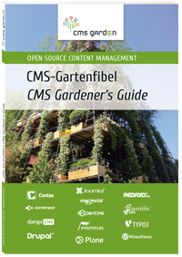
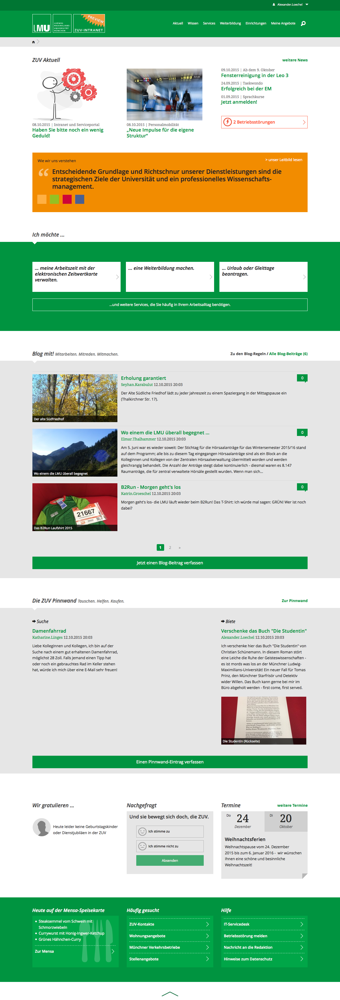

:title: Plone Knowledge to the Rescue
:author: Alexander Loechel
:event: PloneConf 2015 - Bucharest
:keywords: Plone, Zope, Knowledge, PloneConf 2015
:data-transition-duration: 1500
:css-all: css/plone-knowledge-for-rescue.css
:auto-console: Yes

.. role:: slide-title-line1
    :class: line1

.. role:: slide-title-line2
    :class: line2

.. role:: slide-title-line3
    :class: line3

.. |br| raw:: html

     

.. |hr| raw:: html

    

.. role:: python(code)
   :class: highlight code python
   :language: python

.. role:: tcl(code)
   :class: highlight code tcl
   :language: tcl

----

:id: title
:class: slide title-slide level-1
:data-x: 0
:data-y: 0

.. class:: title

.. container:: centered

    .. image:: images/plone-logo.png
        :height: 200px
        :class: centered

Knowledge |br| to the Rescue
============================

.. container:: centered

    Alexander Loechel

----

:id: learning-curve
:class: slide background-image-slide level-1
:data-x: r-3500
:data-y: r+1000

.. container:: overlay centered

    **Complaint:**

    Plone has a steep learning curve

----

:id: rocket-science
:class: slide background-image-slide level-1
:data-x: r+0
:data-y: r+1000

.. container:: overlay-b centered

    **Web Development is not Rocket Science**

----

:id: one-click
:class: slide background-image-slide level-1
:data-x: r+0
:data-y: r+1000

.. container:: overlay-b

    **"one click websites"**

    Implies:

    * everybody could do a website
    * no skills needed

----

:id: soap-car
:class: slide background-image-slide level-1
:data-x: r+0
:data-y: r+1000

.. container:: overlay-b centered

    **Tinkerers**  vs. **Professionals**

.. image:: images/racing-car.jpg
    :width: 400px
    :class: left
    :alt: Racing Car

.. container:: img-quote

    CC3-BY-SA https://als.wikipedia.org/wiki/Datei:Seifenkistenrennen-V%C3%B6lkersbach-Unfall.jpg + CC0 Schuhmacher

----

:id: enterprise
:class: slide background-image-slide level-1
:data-x: r+0
:data-y: r+1000

.. container:: overlay centered

    Plone is targeted at the Enterprise Sector

----

:id: school-bus
:class: slide background-image-slide level-1
:data-x: r+0
:data-y: r+1000

.. container:: overlay centered

    Professional Service is a matter of trust

.. image:: images/DE_licence_front.jpg
    :width: 400px
    :class: centered
    :alt: Drivers Licence

.. container:: img-quote

    CC2-BY-SA https://www.flickr.com/photos/twix/

----

:id: lessons-learned
:class: slide background-image-slide level-1
:data-x: r+1000
:data-y: 1000

Lessons Learned
===============

* Basic Skills

  * Technologies and Tools
  * Philosophies and Mindset

* Special Techniques

* Example Projects

.. container:: overlay centered

    *These are my lessons learned with Plone the CMS and Plone the Community. Other projects, technologies and communities might teach you the same lessons.*

.. container:: img-quote

    CC2-BY https://www.flickr.com/photos/notionscapital/3082592630

----

:id: basics
:class: slide background-image-slide level-1
:data-x: r+0
:data-y: r+1000

.. container:: overlay-b centered

    **Basic Skills**

    * Technologies and Tools

    * Philosophies and Mindset

.. container:: img-quote

    CC2-BY https://simple.wikipedia.org/wiki/Primary_school#/media/File:Heiwa_elementary_school_18.jpg

----

:id: python
:class: slide level-1
:data-x: r+0
:data-y: r+1000

.. image:: images/python-logo.png
    :width: 500px
    :class: centered
    :alt: Python

----

:id: vcs
:class: slide background-image-slide level-1
:data-x: r+0
:data-y: r+1000

.. container:: overlay-b centered

    **Version Control Systems**

    * Process
    * Way back
    * Distributed Teams

----

:id: repeatable
:class: slide background-image-slide level-1
:data-x: r+0
:data-y: r+1000

.. container:: overlay centered

    **Repeatable Environments**

    * Development
    * Staging
    * Production

    **Tools**

    * zc.buildout
    * Ansible

----

:id: quality
:class: slide background-image-slide level-1
:data-x: r+0
:data-y: r+1000

.. container:: overlay centered

    **Quality**

    * Test, Test and Test

      * Unit Tests
      * Integration Tests
      * Acceptance Tests

    * Code Analysis

      * plone.recipe.codeanalysis
      * QuantifiedCode

.. container:: img-quote

    CC-BY https://www.flickr.com/photos/depone/240443029

----

:id: docs
:class: slide background-image-slide level-1
:data-x: r+1000
:data-y: 1000

.

    **DOCUMENTATION FIRST!**

    Think about the process of writing |br| the documentation for your project as |br| *the true act of creation*.

    **Documentation Driven Development**

    Writing documentation is absolutely essential to writing good software.

    Until you've written about your software, you have no idea what you'll be coding.

    Developer documentation is *not* End-user documentation.

    -- Sven Strack - Plone Documentation Team

.. container:: img-quote

    CC3-BY-SA https://commons.wikimedia.org/wiki/File%3ABonanjo_-_Centre_de_documentation_et_information_urbanisme_%28CUD%29_04.JPG

.. note::

    * Documentation is the API contract in Open Source

----

:id: zen
:class: slide background-image-slide level-1
:data-x: r+0
:data-y: r+1000

.. container:: overlay centered

    **The Zen of Python**

    .. code::

        >>> import this
        The Zen of Python, by Tim Peters

        Beautiful is better than ugly.
        Explicit is better than implicit.
        Simple is better than complex.
        Complex is better than complicated.
        Flat is better than nested.
        Sparse is better than dense.
        Readability counts.
        Special cases aren't special enough to break the rules.
        ...

----

:id: community
:class: slide background-image-slide level-1
:data-x: r+0
:data-y: r+1000

.. container:: overlay centered timed

    *It is about how you act*

    **Every contribution counts**

    * Code
    * Bug Reports
    * Documentation
    * Translations
    * Marketing
    * ...

    *Welcoming new Persons to the Community*

.. note::

    **Plone Conference 2012 Arnheim**

    de meeste mensen zwijgen, een enkeling stelt een daad. - Die meisten Menschen schwiegen, ein paar wenige handeln.

----

:id: success
:class: slide background-image-slide level-1
:data-x: r+0
:data-y: r+1000

.. container:: overlay centered

    **Surround yourself with the right people**

    * People smarter than you
    * People that you look up to
    * People that help you
    * People that want you to get ahead
    * People that get you out of your comfort zone
    * People that make you smile

----

:id: user-matters
:class: slide background-image-slide level-1
:data-x: r+1000
:data-y: 1000

.. container:: overlay-b centered

    **The User Counts**

    * The Users **doesn't care** about Systems being used, |br| they just have to work.
    * Don't distract the User

      * no new login
      * no different backends

    * use one Look & Feel

----

:id: intergration-framework
:class: slide background-image-slide level-1
:data-x: r+0
:data-y: r+1000

.. container:: overlay-b centered

    Plone is a |br| **Content Integration Framework**

.. container:: img-quote

    CC2-BY-SA https://en.wikipedia.org/wiki/File:Puzzle_Krypt-2.jpg

.. note::

    *Use the right tool for the job*

----

:id: turnaround
:class: slide level-1
:data-x: r+0
:data-y: r+1000

.

    rapid turnaround:

    VITAL

    -- Sean Kelly - Better Web-Application Development |br| https://www.youtube.com/watch?v=DWODIO6aCUE

----

:id: market
:class: slide background-image-slide level-1
:data-x: r+0
:data-y: r+1000

.. container:: overlay

    * *know the market*
    * *know the other systems in your scope*
    * *use best of breed tools*

----

:id: garden
:class: slide background-image-slide level-1
:data-x: r+0
:data-y: r+1000

.. container:: overlay-b

    * *learn from others,*
    * *exchange knowledge with other communities*

----

:id: techs
:class: slide subtitle-slide level-1
:data-x: r+1000
:data-y: 1000

Special Knowledge
=================

----

:id: ids
:class: slide background-image-slide level-1
:data-x: r+0
:data-y: r+1000

.. container:: overlay centered

    **Users - Authentication - Authorization**

    * Shared IDs
    * Shared Secrets
    * Horizontal and Vertical Single Sign On

.. container:: img-quote

    CC2-BY https://www.flickr.com/photos/16048742@N08/3458184491

----

:id: scaling
:class: slide background-image-slide level-1
:data-x: r+0
:data-y: r+1000

.. container:: overlay-b centered

    **Infinite Scaling**

    .. image:: images/cluster.png
        :height: 500px
        :class: centered
        :alt: Cluster

.. container:: img-quote

    CC4-BY docs.plone.org

----

:id: no-downtime
:class: slide background-image-slide level-1
:data-x: r+0
:data-y: r+1000

.. container:: overlay-b centered

    **Always Up - High Avaliablity**

    * Upgraded with no downtime
    * Infrastructure changes
    * Automatic Failover
    * Different Handlers for specific "users" (eg. robots)

.. container:: img-quote

    CC-BY-SA https://www.flickr.com/photos/61604830@N00/3888972875

----

:id: caching
:class: slide background-image-slide level-1
:data-x: r+0
:data-y: r+1000

.. container:: overlay centered

    **Caching Tricks**

    * Short Time Caching
    * Grace / Stale Fallback
    * Split View Caching

        Web users’ tolerable waiting time and the tolerable waiting time for information retrieval is approximately 2 seconds

        -- Fiona Fui-Hoon Nah - College of Business Administration - University of Nebraska-Lincoln

.. container:: img-quote

    Bundesarchiv, B 145 Bild-F079012-0030 / CC-BY-SA 3.0

----

:id: fixing
:class: slide background-image-slide level-1
:data-x: r+0
:data-y: r+1000

.. container:: overlay

    *Fixing Problems the easiest Way*

    .. code:: apache

        RewriteRule ^(.*)manage(_.*)$ - [L,NC]

        <LocationMatch "^/(manage|manage_main|(.*)/manage(_.*))$" >
         Order deny,allow
         Deny from all
        </LocationMatch>

.. container:: img-quote

    CC2-BY https://www.flickr.com/photos/axel-d/488690177

----

:id: examples
:class: slide subtitle-slide level-1
:data-x: r+1000
:data-y: 1000

Examples from Projects
======================

----

:id: diazo
:class: slide level-1
:data-x: r+0
:data-y: r+1000

Corporate Identity |br| is important
====================================

.. image:: images/diazo-concept.png
    :width: 300px
    :class: right
    :alt: Diazo

* Corporate Design and Brand Identity is important at large groups and institutions.
* Provide one Look & Feel across all application

*Diazo helps to brand Web Applications*

----

:id: diazo-printservice
:class: slide background-image-slide level-1
:data-x: r+0
:data-y: r+1000

----

:id: alchemy
:class: slide level-1
:data-x: r+0
:data-y: r+1000

Write and Read different Backends
=================================

.. image:: images/asic.png
    :height: 350px
    :class: right
    :alt:

Project from 2008 for German Armed Forces in Afghanistan

* Archetypes SQLStorage into a PostgreSQL + PostGIS DB

----

:id: one-domain
:class: slide level-1
:data-x: r+1000
:data-y: 1000

.. image:: images/includes.png
    :height: 300px
    :class: left
    :alt: Includes

.. container:: overlay-b centered

    Serving different systems from one domain

----

:id: complex-setups
:class: slide background-image-slide level-1
:data-x: r+0
:data-y: r+1000

.. container:: overlay-b centered

    *complex is better than complicated*

    * specialized Systems
    * small and readable configurations
    * best of breed tools

----

:id: search
:class: slide level-1
:data-x: r+0
:data-y: r+1000

Searching Across Domains |br| and Different Systems
===================================================

.. image:: images/sp-livesuche.png
    :width: 300px
    :class: right
    :alt:

Backends
--------

* Solr |br| (collective.solr)
* Elastic Search |br| (collective.elasticindex)
* Google Search Appliance |br| (collective.gsa)

Specials
--------

* ACLs
* Live and Advanced Search

----

:id: edit-forms
:class: slide level-1
:data-x: r+0
:data-y: r+1000

Customize UX - Custom Add & Edit Forms
======================================

----

:id: complex-systems
:class: slide background-image-slide level-1
:data-x: r+1000
:data-y: 1000

.

    A complex system that works is invariably found to have envolved from a simple system that worked.
    A complex system designed from scratch never works and cannot be patched up to make it work.
    You have to start over with a working simple system.

    -- Jon Gall

.. container:: img-quote

    CC3-BY-SA https://en.wikipedia.org/wiki/File:Tokyo_by_night_2011.jpg

----

:id: hard-way
:class: slide background-image-slide level-1
:data-x: r+0
:data-y: r+1000

It is a hard way
================

.. note::

    *like every studium*

----

:id: master
:class: slide background-image-slide level-1
:data-x: r+0
:data-y: r+1000

.. container:: overlay centered

    *The difference between a master and a novice is, that the master has failed more often than the novice has tried*

    You can move fast and break things, |br| if you know the procedure to repair it quickly

----

:id: let-it-fly
:class: slide background-image-slide level-1
:data-x: r+0
:data-y: r+1000

.. container:: overlay centered

    Mastering Plone - Mastering Software Development

----

:id: nh90
:class: slide background-image-slide level-1
:data-x: r+0
:data-y: r+1000

----

:id: overview
:data-x: 0
:data-y: 3250
:data-scale: 10
