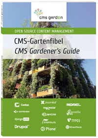
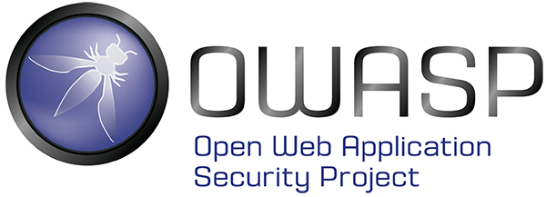
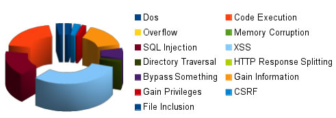
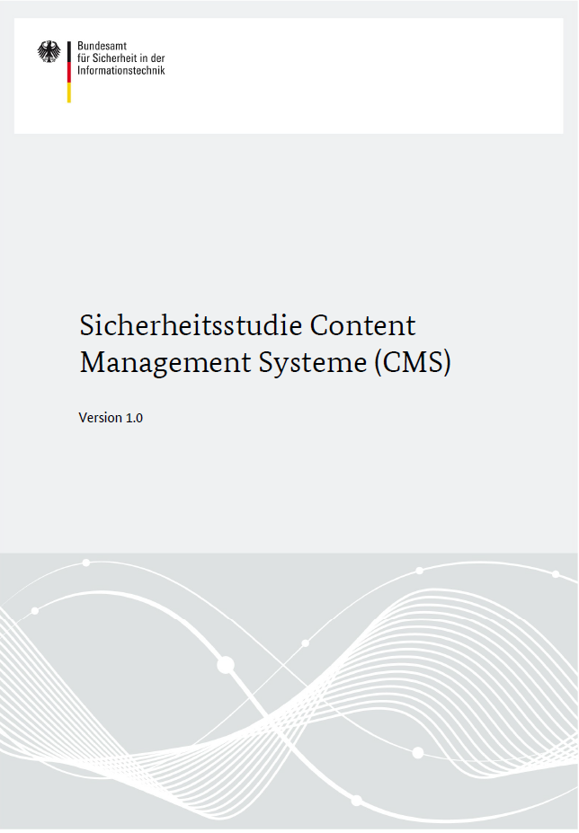
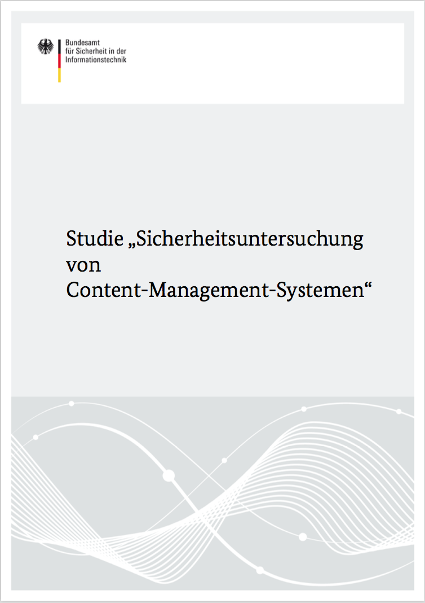

:title: Plone Security in Context
:author: Alexander Loechel
:event: PloneConf 2016 - Boston
:keywords: Plone, Zope, Security, PloneConf 2016
:data-transition-duration: 1200
:css-all: css/plone-security-in-context.css
:auto-console: Yes

.. role:: slide-title-line1
    :class: line1

.. role:: slide-title-line2
    :class: line2

.. role:: slide-title-line3
    :class: line3

.. |br| raw:: html

     

.. |hr| raw:: html

    

.. |rarr| raw:: html

    &rarr;

.. role:: python(code)
   :class: highlight code python
   :language: python

----

:id: title
:class: slide title-slide level-1
:data-x: 0
:data-y: 0

.. class:: title

.. container:: centered

    .. image:: images/logos/plone-logo.png
        :height: 200px
        :class: centered

Security in Context
===================

.. container:: centered

    Alexander Loechel

----

:id: security-basics
:class: slide background-image-slide level-1
:data-x: r-5000
:data-y: r+1000

.. container:: overlay

    **What is Security?**

    |rarr| Security vs Safety

    **IT-Security (InfoSec triad)**

    * Confidentiality
    * Integrity / Authenticity
    * Availability

    |rarr| Attack Vectors

    **Safety**

    * Functional correctness

    |rarr| does the software behave like it should

    |rarr| Reliability Engineering

.. container:: img-quote

    CC3-BY-SA https://commons.wikimedia.org/wiki/File:Scutum_1.jpg

----

:id: context
:class: slide background-image-slide level-1
:data-x: r+0
:data-y: r+1000

.. container:: overlay-b centered

    **Security in Context**

    Definition of Context

    * CMS-Market
    * Web-Technologies

----

:id: market
:class: slide background-image-slide level-1
:data-x: r+0
:data-y: r+1000

----

:id: market-perspective
:class: slide background-image-slide level-1
:data-x: r+0
:data-y: r+1000

----

:id: garden
:class: slide background-image-slide level-1
:data-x: r+0
:data-y: r+1000

CMS-Garden
==========

.. container:: overlay-b

    * *learn from others,*
    * *exchange knowledge with other communities*
    * *cooperation on Security Teams and contact with Security Institutions*

    Lot of Security Research on larger Systems:

    * Wordpress
    * Joomla
    * Drupal
    * Plone

----

:id: is-plone-secure
:class: slide background-image-slide level-1
:data-x: r+1000
:data-y: 1000

Is Plone Secure?
================

----

:id: is-plone-secure-answer1
:class: slide background-image-slide level-1
:data-x: r+0
:data-y: r+1000

.. container:: overlay centered

    **It Depends**

    * Plone Core itself is pretty secure
    * Security of an installation depends on |br| the installation and maintenance

    *so basically*

    **YES**

    **Plone is pretty secure**

----

:id: is-plone-secure-answer2
:class: slide background-image-slide level-1
:data-x: r+0
:data-y: r+1000

.. container:: overlay centered

    **But Why is it Secure?**

    *And what are good indicators for security?*

    * Do Number of Published Problems |br| (CVEs and CVE Scores) give a good comparison?
    * Number of Hacked Sites?
    * spotted Zero Day Exploides?

    **SORRY NO!**

    *Those are not objective and relevant comparison and those do not reflect the current situation*

----

:id: proof-of-security
:class: slide level-1
:data-x: r+1000
:data-y: 1000

How to proof Security
=====================

* Security is a **process** not a **state**
* Real Security could not be tested automatically |br| |rarr| known vulnerability could

Approach
--------

* Manually test for common Attack Vectors (|rarr| *OWASP Study - Top 10 List of Most Critical Web Application Security Risks*)
* Analyze Processes of the Developer
* Analyze Processes of the Security Team
* Analyze Release Process (Bugfix, Hotfix-Releases)
* Information Policy
* Dependency of Developers

.. note::

    OWASP |rarr| Open Web Application Security Project

----

:id: owasp-top10
:class: slide level-1
:data-x: r+0
:data-y: r+1000

OWASP Top 10 Report
===================

*(Last 2013 - new Version for 2016 in Progress)*

.. image:: images/OWASP-report.png
    :width: 280px
    :class: right
    :alt: OWASP Report - Top 10 from 2013

#. Injection
#. Broken Authentication and Session Management
#. Cross-Site Scripting (XSS)
#. Insecure Direct Object References
#. Security Misconfiguration
#. Sensitive Data Exposure
#. Missing Function Level |br| Access Control
#. Cross-Site Request Forgery (CSRF)
#. Using Known Vulnerable Components
#. Unvalidated Redirects and Forwards

----

:id: numbers1
:class: slide level-1
:data-x: r+0
:data-y: r+1000

Compare sources |br| of Vulnerabilities in |br| common CMSs
===========================================================

----

:id: numbers2
:class: slide level-1
:data-x: r+0
:data-y: r+1000

State 2013
==========

.. container:: results2013_chart

    .. raw:: html

        &nbsp;

.. container:: results2013_chart2

    .. raw:: html

        &nbsp;

.. container:: info

    study from 2013 which just does a literature analyzes

.. note::

    BSI CMS-Sicherheitsstudie 2013
    BSI CMS Studie 2016 (not published)

----

:id: numbers3
:class: slide level-1
:data-x: r+0
:data-y: r+1000

State 2016
==========

.. container:: rotated-warning

    unpublished

.. container:: results2016_chart

    .. raw:: html

        &nbsp;

.. container:: info

    A new study with detailed penetration tests

.. note::

    BSI CMS-Sicherheitsstudie 2013
    BSI CMS Studie 2016 (not published)

----

:id: comparison-question
:class: slide level-1
:data-x: r+1000
:data-y: 1000

So Plone is more secure |br| in comparison to?
----------------------------------------------

* Wordpress
* Joomla
* Drupal
* Typo3
* ...

----

:id: comparison-answer
:class: slide background-image-slide level-1
:data-x: r+0
:data-y: r+1000

.. container:: overlay centered

    **YES & NO**

    *NO*

    * The other CMS's itself are also **secure**
    * Security is a process and depends on the setup and maintenance

    *YES*

    * CMS itself are normally not enough |br| |rarr| *Plugins* |rarr| source of most vulnerabilities
    * Empirical Result |rarr| we do see a lot of hacked WordPress, Joomla, Drupal, Typo3 instances around

    **But why Plone seems**
    **to be more Secure?**

----

:id: reasons1
:class: slide level-1
:data-x: r+0
:data-y: r+1000

Reasons Why Plone is more Secure
================================

* Different Focus

  * Plone strenghs are Intranets
  * Plone is not only a CMS it is actually a Portal Engine

* Python |rarr| Zen of Python
* System Design |br| |rarr| RestrictedPython, AccessControl, ... |br| |rarr| Security and Permisson Checks
* No SQL Database |rarr| no SQL injection possible
* Best of Breed Approach |br| |rarr| DRY-Princip or why should we build all tools ourself
* Code / Addon Skeletons / Templates (ZopeSkel, mr.bob)

----

:id: reasons2
:class: slide level-1
:data-x: r+0
:data-y: r+1000

Additional Reasons |br| why Plone is more Secure |br| for most users
====================================================================

* Zope/Plone is very complex |rarr| *Security by obscurity*
* Zope/Plone has not a large *market share* |br| |rarr| not interesting for bot networks
* Zope/Plone is used by several high value targets |br|
  |rarr| Normally those will get attacked first |br|
  |rarr| attacks against them might not get published.
* Zope/Plone users are normally more aware of security concepts and web technologies

----

:id: complex-systems
:class: slide background-image-slide level-1
:data-x: r+1000
:data-y: 1000

.

    A complex system that works is invariably found to have envolved from a simple system that worked.
    A complex system designed from scratch never works and cannot be patched up to make it work.
    You have to start over with a working simple system.

    -- Jon Gall

.. container:: img-quote

    CC3-BY-SA https://en.wikipedia.org/wiki/File:Tokyo_by_night_2011.jpg

----

:id: back2basics
:class: slide level-1
:data-x: r+0
:data-y: r+1000

Back to the Basics
==================

Safety
------

*The system behaves like it should*

IT-Security (InfoSec triad)
---------------------------

* Confidentiality
* Integrity / Authenticity
* Availability

----

:id: safety
:class: slide background-image-slide level-1
:data-x: r+1000
:data-y: 1000

.. container:: img-quote

    CC2-BY-SA - Blue Coat Photos - https://www.flickr.com/photos/111692634@N04/11406986464/in/photostream/

----

:id: zen
:class: slide background-image-slide level-1
:data-x: r+0
:data-y: r+1000

.. container:: overlay centered

    **The Zen of Python**

    .. code::

        >>> import this
        The Zen of Python, by Tim Peters

        Beautiful is better than ugly.
        Explicit is better than implicit.
        Simple is better than complex.
        Complex is better than complicated.
        Flat is better than nested.
        Sparse is better than dense.
        Readability counts.
        Special cases aren't special enough to break the rules.
        ...

.. note::

    * Understanding of the Code
    * Maintainability
    * Reduction to the minimum |rarr| Donald Knuth - Preamture Optimazation is the root of all evel

----

:id: test
:class: slide background-image-slide level-1
:data-x: r+0
:data-y: r+1000

.. container:: overlay centered

    **Code Conventions and Test Coverage**

    * Enforcement of Code Conventions in the Core

    * Enforcement of Tests (Unit and Functional Test) for Core

    |rarr| The Plone Community ensures functional correctness

    **Tools**

    * plone.recipe.codeanalysis
    * mr.docs

----

:id: skeletons
:class: slide background-image-slide level-1
:data-x: r+0
:data-y: r+1000

.. container:: overlay centered

    **Skeletons and Code Generators**

    * mr.bob
    * ZopeSkel / Paster / Templer (old way)

----

:id: owasp-answer
:class: slide background-image-slide level-1
:data-x: r+1500
:data-y: 1000

----

:id: security-track
:class: slide background-image-slide level-1
:data-x: r+1000
:data-y: 1000

----

:id: it-security
:class: slide background-image-slide level-1
:data-x: r-500
:data-y: 2000

.. container:: overlay centered

    **IT-Security**
    *(InfoSec triad)*

    * Confidentiality
    * Integrity / Authenticity
    * Availability

.. container:: img-quote

    CC3-BY-SA https://en.wikipedia.org/wiki/File:CIAJMK1209.png

----

:id: Confidentiality
:class: slide background-image-slide level-1
:data-x: r-1000
:data-y: 3000

----

:id: workflows-permissions
:class: slide background-image-slide level-1
:data-x: r+0
:data-y: r+1000

.. container:: overlay

    **Permissions & Workflow**

    * Roles

    * Permissions

    * Guards

    |rarr| but standard model is not enough for high confidential content - admins could see everything

    |rarr| but also Custom Workflows could hide content from higher roles like managers

----

:id: Integrity
:class: slide background-image-slide level-1
:data-x: r+1000
:data-y: 3000

Integrity / Authenticity
========================

----

:id: RestrictedPython
:class: slide background-image-slide level-1
:data-x: r+0
:data-y: r+1000

.. container:: overlay

    **RestrictedPython & AccessControl**

    all attributes and objects has guarded methods for read and write

    |rarr| permission to read and write objects and attributes

    |rarr| automatically on all objects and the catalog

    **History**

    All Changes are recorded, you can inspect who did what

----

:id: setup
:class: slide background-image-slide level-1
:data-x: r+0
:data-y: r+1000

.. container:: overlay centered

    **Setup and Plone Deployment**

    * zc.buildout with plone_buildout & plone_deamon users

    * Disallow to change Application by itself

    * Separates application and data

    *The Problem of PHP*

    * PHP did not have an Application server
    * PHP suffer the "Von Neumann architecture" (code and date share same memory)
      |rarr| Data or Code could modify the system on the fly

    * PHP Addons is a large problem
      |rarr| matter of trust and tests

.. container:: img-quote

    CC3-BY-SA https://commons.wikimedia.org/wiki/File:Wikimedia_Foundation_Servers-8055_19.jpg

----

:id: sanitized-input
:class: slide background-image-slide level-1
:data-x: r+0
:data-y: r+1000

.. container:: overlay-b centered

    **Sanitized Input**

    * Cleanup HTML Markup (RichText Fields) |rarr| Filter

    * Escape HTML Entities in other fields (Attention: 'structure' in templates)

    **CSRF-Protection**

----

:id: Availiablity
:class: slide level-1
:data-x: r+1000
:data-y: 3000

Availiablity
============

----

:id: scaling
:class: slide background-image-slide level-1
:data-x: r+0
:data-y: r+1000

.. container:: overlay-b centered

    **Infinite Scaling**

    .. image:: images/cluster.png
        :height: 500px
        :class: centered
        :alt: Cluster

.. container:: img-quote

    CC4-BY docs.plone.org

----

:id: no-downtime
:class: slide background-image-slide level-1
:data-x: r+0
:data-y: r+1000

.. container:: overlay-b centered

    **Always Up - High Avaliablity**

    * Upgraded with no downtime
    * Infrastructure changes
    * Automatic Failover
    * Different Handlers for specific "users" (eg. robots)

.. container:: img-quote

    CC-BY-SA https://www.flickr.com/photos/61604830@N00/3888972875

----

:id: caching
:class: slide background-image-slide level-1
:data-x: r+0
:data-y: r+1000

.. container:: overlay centered

    **Caching Tricks**

    * Short Time Caching
    * Grace / Stale Fallback
    * Split View Caching

        Web users’ tolerable waiting time and the tolerable waiting time for information retrieval is approximately 2 seconds

        -- Fiona Fui-Hoon Nah - College of Business Administration - University of Nebraska-Lincoln

.. container:: img-quote

    Bundesarchiv, B 145 Bild-F079012-0030 / CC-BY-SA 3.0

----

:id: banning
:class: slide background-image-slide level-1
:data-x: r+0
:data-y: r+1000

.. container:: overlay centered

    **Active Bans**

    *Misbehaving Clients get automatically banned*

    |rarr| **Fail2Ban**

----

:id: work-security-teams
:class: slide background-image-slide level-1
:data-x: r+1000
:data-y: 1000

.. container:: overlay-b centered

    **Work of a Security Team**

    *de meeste mensen zwijgen, een enkeling stelt een daad*
    *Most people stay silence, only a few act*

----

:id: other-security-teams-better
:class: slide background-image-slide level-1
:data-x: r+0
:data-y: r+1000

.. container:: overlay centered

    **What do other Security Teams do better?**

    * More Secure Communication Channels (S/MIME / GPG-Keys for Communication are published)
    * More Usage of Issue Tracker for Communications
    * More communication with Hoster of the CMS (Joomla)
    * *Phone Home Function*

      * Auto-Update
      * Info in Control-Panels

    * CSV Reports

    Other Community might have a larger Community

    |rarr| active Review and Inspection of CMS-Core Modules

----

:id: joomla-security-teams-better
:class: slide background-image-slide level-1
:data-x: r+0
:data-y: r+1000

.. container:: overlay centered

    **What do other Security Teams do better?**

    **Good Example Joomla! Community**

    * More communication with Hoster of the CMS
    * Better Information on Project Home Page

      * https://developer.joomla.org/security-centre.html
      * https://docs.joomla.org/Security
      * https://extensions.joomla.org/category/access-a-security/site-security

----

:id: other-security-teams-worse
:class: slide background-image-slide level-1
:data-x: r+0
:data-y: r+1000

.. container:: overlay centered

    **What Do other Security Teams do worse?**

    .. image:: images/SA-CORE-2014-005.png
        :width: 200px
        :class: right
        :alt:

    * Security Team is attached to one large provider and supply patches to customers before official release
    * Only Bugfix-Releases no Hotfixes
    * No Security Information Available
    * No Security Process on Add-Ons - Communication Process

----

:id: recomendations
:class: slide background-image-slide level-1
:data-x: r+1000
:data-y: 1000

----

:id: asis
:class: slide background-image-slide level-1
:data-x: r+0
:data-y: r+1000

.. container:: overlay-b centered

    *never use a system "as is"*

----

:id: min
:class: slide background-image-slide level-1
:data-x: r+0
:data-y: r+1000

.. container:: overlay-b centered

    *every system should get at least 15 minutes of care per day*

----

:id: survey
:class: slide background-image-slide level-1
:data-x: 0
:data-y: 10000

----

:id: overview
:data-x: 0
:data-y: 3500
:data-scale: 10

.. raw:: html

    