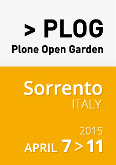
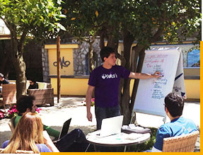

:title: Plone Strategic Summit 2015
:author: Alexander Loechel
:event: Plone Hochschul User Group Meeting
:keywords: Plone, Python, Universitäten, Workshop
:data-transition-duration: 1500
:css-all: css/summit.css
:auto-console: Yes

.. role:: slide-title-line1
    :class: line1

.. role:: slide-title-line2
    :class: line2

.. role:: slide-title-line3
    :class: line3

.. |br| raw:: html

     

.. |hr| raw:: html

    

.. role:: python(code)
   :class: highlight code python
   :language: python

----

:id: title
:class: slide title-slide centered level-1
:data-x: 0
:data-y: 0

.. comment :class: slide lmu-slide title-slide lmu-title-slide centered level-1

.. container:: centered

    .. image:: images/plone-logo.png
        :height: 200px
        :class: centered tspacer bspacer

Strategic Summit |br|  7.-11. April 2015
========================================

.. note::

    * Test Note

----

:id: what-h
:class: slide level-1
:data-x: r-1000
:data-y: 1000

Was ist ein Strategic Summit
============================

* Strategische Diskussionen rund um die Zukunft eines Projekt
* Direkter Austausch
* Diskussions- und Entscheidungsrunde
* bei weltweit verteilten Teams sind persönliche Kontakte wichtig

----

:id: what-g
:class: slide level-1
:data-x: r-0
:data-y: r+1000

Plone Strategic Summit
======================

* Plone ist ein großen Open Source Projekt

  * > 350 aktive Core Entwickler
  * weltweit verteilte Nutzer und Entwickler

* strategische Diskussionen benötigen persönliche Kontakte
* Plone ist ein Community Produkt

  * keine Firma mit einer Produktstrategie dominiert
  * kein BDFL
  * Community kann jederzeit neue Ideen einbringen und umsetzten,
    Integration in den Kern geht über PLIPS und Abstimmungen des Framework-Team

* die internationale Plone Conference ist dafür der falsche Ort

----

:id: presteps
:class: slide level-1
:data-x: r-0
:data-y: r+1000

Bisherige Schritte zu einer Roadmap 2020
========================================

Diskussionen zu einer Neufassung der http://plone.org/roadmap - Roadmap 2020

* jedes Jahr bei der internationalen Plone Konferenz Diskussionen um die Zukunft und wie es weiter geht.

Planung Strategic Summit 2015
=============================

* https://community.plone.org/t/announcing-the-plog-strategic-summit/440
* https://plone.org/news/sponsor-the-plog-strategic-summit

Zeitliche Koordination schwer.

* PLOG überschneidet sich mit PyCon US
* 2 Remote Sessions geplant.

----

:id: dino
:class: slide overlay level-1
:data-x: r+1000
:data-y: 1000

.. container:: overlay

    **Warum ist ein Strategic Summit notwendig**

    * Nächstes großes Release vor der Tür (Plone 5.0)
    * Der Web-Markt verändert sich stark

      * Client Side Story hat sich massiv geändert
      * JavaScript Frontends
      * Responsive Design

    * Python 2.7 End of Live - Python 3 Transition
    * Plone Roadmap 2020 Diskussion soll fokusiert werden

        Plone soll weiterhin Innovationen prägen |br| und nicht legacy werden

----

:id: prevsummit
:class: slide overlay level-1
:data-x: r+0
:data-y: r+1000

Summit 2008
===========

.. note::

    * 2008 Google Plex
    * 2009 Plone 3.3

----

:id: plog
:class: slide overlay level-1
:data-x: r+0
:data-y: r+1000

* Ehemals Plone Symposium Europa
* 5 Tage Strategic Summit
* Offen für alle / Community-Driven
* > 100 Anmeldungen bisher

----

:id: ablauf-generell
:class: slide level-1
:data-x: r+1000
:data-y: 1000

Ablauf und Themen
=================

* *keeping up with the Joneses* / Technologische Zukunft

  * Backend & Frontend

    * Python 3 (2020 Support Ende Python 2, |br| Basis Technologie)
    * JavaScript Frontends

* *provider ecosystem, marketing & positioning*

  * Lessons learned vom Intranet Consortium Projekt
  * Unterschiede in der Marktsituation weltweit
  * Plone Marekting

  * Diskussion Plone TTW Zukunft

* *approachability & community*

  * Neue Entwickler für Plone interessieren
  * Kunden stärker einbinden
  * Neue Firmen als Plone Provider integrieren

----

:id: segments
:class: slide level-1
:data-x: r+0
:data-y: r+1000

.. container:: overlay

    **Wichtige Nutzer / Sektoren**

    * **Education**
    * Nonprofits
    * Government
    * Small Business
    * Large Enterprise
    * Media/Publishing

----

:id: input
:class: slide level-1
:data-x: r+0
:data-y: r+1000

Eure Meinung ist wichtig
========================

*Was ist aus eurer Sicht das entscheidende, was Plone ausmacht, wohin es gehen muss und was es nicht verlieren darf?*

* gerne heute diskutieren
* mir eine Mail mit Punkten für die Diskussion in Sorrento

----

:id: overview
:data-x: 0
:data-y: 1500
:data-scale: 6

